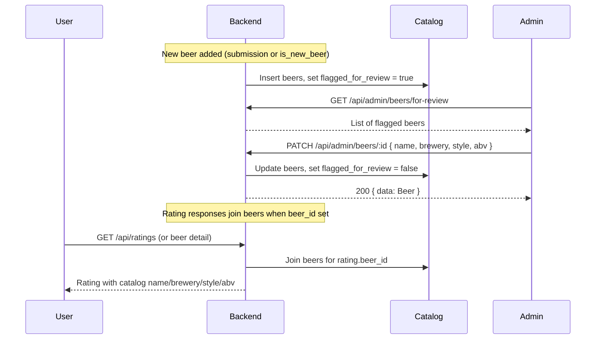

# Admin Flag New Beers and Edit Catalog (Beer Name, Brewery, ABV, Style)

## Context

- **Catalog**: [beers](docs/database-schema.sql) table holds canonical beer data (`name`, `brewery_name`, `style`, `abv`, `source` e.g. `user_submitted`). [ratings](docs/database-schema.sql) stores denormalized `beer_name`, `brewery`, `style`, `abv` and optional `beer_id` FK.
- **New beers**: Today new beers can enter via (1) `beer_submissions` (admin approve/reject) with `created_beer_id` on approval, or (2) possibly direct creation from `POST /api/ratings` when `is_new_beer` (backend contract says "May create new beers row"). Either way, user-submitted names can have typos.
- **Admin today**: Mobile has [AdminScreen](src/screens/admin/AdminScreen.tsx) with Challenges, Achievements, Featured Beers, Cosmetics. Backend has `GET /api/admin/tabs/submissions` and `PATCH /api/admin/tabs/submissions/:id` (approve/reject only — no catalog edit). There is no admin endpoint to **edit** a beer's name, brewery, abv, or style.

## Goals

1. **Flag new beers for admin review** — So admins can see which catalog beers were recently added (or explicitly flagged) and need a correctness pass.
2. **Admin edit of beer metadata** — From a review/rating context or from a "beers to review" list, admin can edit **Beer Name, Brewery, ABV, Style**.
3. **Changes reflect in the catalog** — Edits update the canonical `beers` row; display everywhere (catalog browse, beer detail, rating cards that reference that beer) should use catalog data so one source of truth.

---

## 1. Backend: Flagging and listing beers for review

**Option A – Use “recent + source” (no schema change)**  

- Add **GET /api/admin/beers/for-review** (or **GET /api/admin/catalog/beers/for-review**).
- Query: `beers` where `source = 'user_submitted'` (and optionally `created_at` within last N days), ordered by `created_at DESC`, paginated.
- Response: same shape as catalog beer list (id, name, brewery_name, style, abv, created_at, source). Optional: include `rating_count` or first rating id for “edit from review” context.
- No new columns; “flagged” is implied by being in this list.

**Option B – Explicit flag on beers**  

- Migration: add `flagged_for_review BOOLEAN DEFAULT FALSE` (and optionally `flagged_at TIMESTAMPTZ`) to `beers`.
- When a beer is created from a submission or from `is_new_beer` rating, set `flagged_for_review = TRUE`.
- **GET /api/admin/beers/for-review**: list where `flagged_for_review = TRUE` (paginated).
- **PATCH /api/admin/beers/:id** (see below): when admin saves edits, set `flagged_for_review = FALSE` (and clear `flagged_at`).

Recommendation: **Option B** so admins can clear the list by reviewing and so “flag” is explicit and auditable.

---

## 2. Backend: Admin edit beer (catalog)

- **PATCH /api/admin/beers/:id** (or **PATCH /api/admin/catalog/beers/:id**).
  - Auth: `authMiddleware` + `adminMiddleware` (same as other admin routes).
  - Body (all optional): `name`, `brewery_name` (or link to `brewery_id`), `style`, `abv`.
  - Validation: same rules as catalog (e.g. name non-empty, abv 0–30 if present).
  - Response: **200** with `{ data: Beer }` (updated row).
  - Side effects:
    - Update `beers` row (`name`, `brewery_name`, `style`, `abv`, `updated_at`). If brewery is edited and you store `brewery_id`, resolve/create brewery as needed per existing catalog rules.
    - **Catalog as source of truth**: Any API that returns rating or beer detail should, when `rating.beer_id` is set, **prefer catalog fields** (join or lookup from `beers`) for name, brewery, style, abv on the rating payload. That way one update to `beers` reflects everywhere without a mass update of `ratings`. If the backend currently returns only denormalized rating columns, add a join/lookup so that when `beer_id` is present, response uses `beers.name`, `beers.brewery_name`, etc., for that rating’s display.
    - Optional: if you want denormalized consistency for legacy or search, run an async job or trigger that updates `ratings.beer_name`, `ratings.brewery`, `ratings.style`, `ratings.abv` where `ratings.beer_id = :id`. Not required if all consumers use catalog-joined data.
  - When using Option B (flagged): set `flagged_for_review = FALSE` (and clear `flagged_at`) on successful edit so the beer drops off the “for review” list.

---

## 3. Backend: Entry from a “review” (rating)

- Admin needs to open “edit beer” from a **rating/review** context (e.g. “Edit beer info” on a rating card in admin or feed).
- **GET /api/admin/ratings/:id** (optional): return rating plus linked beer (if `rating.beer_id` set) so admin UI can pre-fill the beer form. If not added, mobile can pass `ratingId` and backend can resolve beer from `ratings.beer_id` or from rating’s denormalized fields for display; edit still goes to **PATCH /api/admin/beers/:id** (beer id from rating).
- So: from a rating, frontend needs at least `rating.beer_id` and current beer name/brewery/style/abv (from rating or from catalog). If `beer_id` is null, admin could either (a) create a new catalog beer from this rating and link it, or (b) show “No catalog beer linked” and only allow editing when a beer exists. Plan assumes (b) for v1: admin can only edit catalog beers; if the rating has no `beer_id`, show message or offer “Add to catalog” as future work.

---

## 4. Mobile: Admin API and types

- **Types** ([src/types/api.ts](src/types/api.ts) or models): Reuse or extend `Beer` for admin beer; add `AdminBeerForReview` if the for-review list has extra fields (e.g. `flagged_at`, `rating_count`). Add `PatchBeerPayload`: `{ name?: string; brewery_name?: string; style?: string; abv?: number | null }`.
- **API** ([src/api/admin.ts](src/api/admin.ts)): Add:
  - `getBeersForReview(params?: { limit; offset })` → `GET /api/admin/beers/for-review`.
  - `patchBeer(beerId: string, payload: PatchBeerPayload)` → `PATCH /api/admin/beers/:beerId`, return `{ data: Beer }`.
- All behind existing admin auth (same as other admin calls).

---

## 5. Mobile: Admin UI

- **New tab/panel**: In [AdminScreen](src/screens/admin/AdminScreen.tsx), add a tab **“Catalog review”** (or “New beers”) that lists beers returned from `GET /api/admin/beers/for-review` (paginated list: name, brewery, style, abv, created/flagged date).
- **Row actions**: Each row has **Edit** (and optionally **Clear flag** if you only want to dismiss without editing). Edit opens a modal or inline form with fields: Beer Name, Brewery, ABV, Style (same as catalog). Save calls **PATCH /api/admin/beers/:id**; on success refresh the list and close form; show a short success message.
- **From a rating (optional v1)**: If admin can open a rating (e.g. from a future “Admin feed” or from a deep link), add an “Edit beer” action that navigates to the same edit-beer form pre-filled with that rating’s beer (using `rating.beer_id` and current name/brewery/style/abv). If no `beer_id`, show “Not linked to catalog” and no edit (or link to “Add to catalog” later).

---

## 6. Display: Catalog as source of truth

- Backend must ensure that wherever a **rating** is returned and has `beer_id` set, the **display** name, brewery, style, abv come from the **beers** row (join or post-fetch). That way:
  - Admin edits the beer via PATCH → only `beers` is updated.
  - All clients (mobile feed, beer detail, catalog) that show that rating get correct name/brewery/style/abv from catalog.
- If the backend currently returns only `ratings.beer_name`, `ratings.brewery`, etc., add logic (e.g. in rating serialization or in BFF) to overlay `beers.name`, `beers.brewery_name`, `beers.style`, `beers.abv` when `ratings.beer_id` is not null. Document in [API_CONTRACT_MOBILE.md](docs/API_CONTRACT_MOBILE.md) and backend contract.

---

## 7. Summary flow

---

## 8. Implementation order

1. **Backend**: Add `flagged_for_review` (and optional `flagged_at`) to `beers`; set true when creating beer from submission or is_new_beer. Add **GET /api/admin/beers/for-review** and **PATCH /api/admin/beers/:id** (body: name, brewery_name, style, abv; clear flag on PATCH). Ensure rating responses use catalog for display when `beer_id` is set.
2. **Docs**: Update [docs/backend_references/API_CONTRACT.md](docs/backend_references/API_CONTRACT.md) and [docs/API_CONTRACT_MOBILE.md](docs/API_CONTRACT_MOBILE.md).
3. **Mobile**: Admin API (`getBeersForReview`, `patchBeer`), types, then new “Catalog review” panel in AdminScreen with list and edit form; on success refresh list and show success.

This plan keeps the catalog as the single source of truth for beer metadata and gives admins a clear path to flag new beers and fix name/brewery/abv/style so changes reflect everywhere.