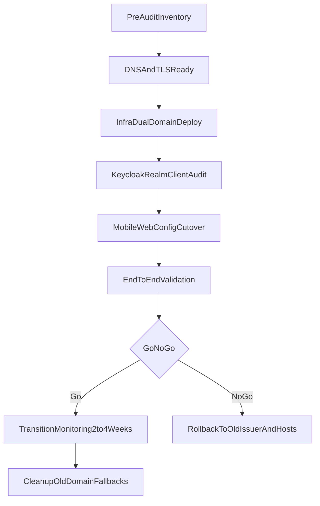

# BeerBook Domain Audit + Migration Plan

## Goal

Migrate BeerBook web/API/auth traffic to `beerbookapp.com` domains without downtime, while validating auth/token behavior, client compatibility, and rollback safety.

## Scope And Baseline

- Use the existing migration draft as source of truth: [c:\Users\kenyo\OneDrive\Desktop\daw-platform\daw-platformcursor\plans\beerbookappRollout.md](c:\Users\kenyo\OneDrive\Desktop\daw-platform\daw-platform.cursor\plans\beerbookappRollout.md).
- Use current container/router/env implementation as deployment baseline: [c:\Users\kenyo\OneDrive\Desktop\daw-platform\daw-platformcursor\plans\docker-compose.yml](c:\Users\kenyo\OneDrive\Desktop\daw-platform\daw-platform.cursor\plans\docker-compose.yml).
- Keep old `*.drinksafterwork.net` BeerBook subdomains active during transition.

## Migration Flow

## Phase 0: Pre-Audit Inventory (No Changes)

- Confirm authoritative records and ownership for `beerbookapp.com` and existing `drinksafterwork.net` subdomains.
- Capture current production values for:
  - Keycloak hostname and realm frontend URL.
  - BeerBook API auth env vars (`KEYCLOAK_ISSUER`, `KEYCLOAK_JWKS_URI`, `KEYCLOAK_URL`, `CORS_ORIGIN`).
  - Traefik router host rules for `beerbook`, `beerbook-api`, and `keycloak`.
- Build a dependency matrix of every place old domains appear (infra, app config, Keycloak clients, Apple/Google OAuth settings, deep-link assets).
- Define rollback trigger thresholds (e.g., login failure rate, token validation errors, 5xx increase).

## Phase 1: DNS/TLS Readiness

- Configure Cloudflare zone and A/CNAME records for apex, `www`, `api`, and `auth` to Hetzner IP.
- Decide TLS strategy before cutover:
  - Preferred: Cloudflare Origin Certificate + Traefik TLS file provider.
  - Alternative: DNS-only records so Traefik ACME HTTP challenge works.
- Validate certificates and hostname coverage for `beerbookapp.com`, `api.beerbookapp.com`, `auth.beerbookapp.com`.

## Phase 2: Infra Dual-Domain Deployment

- Deploy dual-domain compose configuration (new domains primary, old retained in router rules).
- Recreate only impacted services: `keycloak`, `beerbook`, `beerbook-api`.
- Validate post-deploy:
  - Traefik routes resolve for both old and new hosts.
  - API health endpoint passes via old and new API domains.
  - Auth discovery (`/.well-known/openid-configuration`) returns expected issuer on new auth domain.

## Phase 3: Keycloak Audit + Migration

- Update realm frontend URL to `https://auth.beerbookapp.com`.
- For each DAW realm client (`beerbook-mobile`, `beerbook-service`, others):
  - Add new redirect URIs and post-logout URIs.
  - Add new web origins while keeping old origins during transition.
- Audit external IdPs (Apple/Google/etc.) for callback URL updates to new auth domain.
- Validate login, refresh token flow, and logout flow on both old and new web entry points.

## Phase 4: Application Cutover

- Update app/web config to new API/auth URLs.
- Update OIDC issuer references to new auth realm URL.
- Validate mobile deep-link/universal-link artifacts (`apple-app-site-association`, `assetlinks.json`) served from new domain.
- Release app build with migration note: existing users may re-authenticate as old-issuer tokens age out.

## Phase 5: Verification + Monitoring

- Execute smoke tests (web load, login, token exchange, API protected routes, logout).
- Monitor for at least 2 weeks:
  - Auth errors by issuer mismatch.
  - CORS failures.
  - OAuth callback failures.
  - Traefik TLS/router anomalies.
- Gate cleanup only after error rates stabilize and traffic predominantly uses new domains.

## Phase 6: Cleanup + Finalization

- Remove old domain host fallbacks from Traefik router rules.
- Remove old domain values from `CORS_ORIGIN`, Keycloak redirect URIs, and web origins.
- Optionally add 301 redirects from old BeerBook subdomains to new domains.
- Publish final migration runbook and post-migration audit report.

## Deliverables

- Updated audited runbook (this plan + execution checklist).
- Dependency inventory of all domain references and owners.
- Go/No-Go checklist with rollback procedure.
- Post-cutover verification record and cleanup sign-off.

