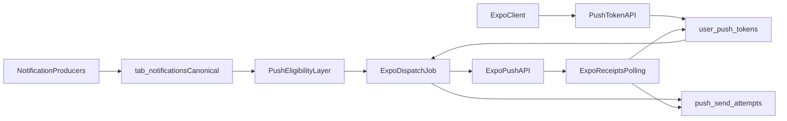

# Expo Push Delivery Plan (Backend Track)

## 1. Before-coding inspection

### current frontend state

- No Expo/React Native mobile app or push registration code exists in this repository.
- Current client (`apps/beerbook`) consumes in-app notifications via `GET /api/tabs/notifications` and marks read via PATCH endpoints.
- Notification action metadata (`target_type`, `target_id`) is already part of API docs and payload shape, but web click handling currently focuses on mark-read behavior.

### current backend state

- `tab_notifications` is the canonical notification table and already includes `notification_type`, `title`, `message`, `metadata`, `is_read`, `week_start`, `target_type`, `target_id`.
- Producers currently include:
  - direct writers in `[apps/beerbook-api/routes/tabs.js](apps/beerbook-api/routes/tabs.js)` (`seeder_granted`, `tier_promotion`, `beer_approved`, `beer_rejected`)
  - moderation path in `[apps/beerbook-api/lib/uploadModeration.js](apps/beerbook-api/lib/uploadModeration.js)` (`photo_removed`)
  - scheduler scripts in `[apps/beerbook-api/scripts/weekly-tabs-eval.js](apps/beerbook-api/scripts/weekly-tabs-eval.js)` and `[apps/beerbook-api/scripts/streak-risk-check.js](apps/beerbook-api/scripts/streak-risk-check.js)` via RPC `insert_scheduler_notification`.
- Existing dedupe/idempotency exists for scheduler-generated notifications through unique index on `(user_id, notification_type, week_start)` and job-run claiming/completion in migration `[apps/beerbook-api/supabase/migrations/20260307100000_scheduler_idempotency.sql](apps/beerbook-api/supabase/migrations/20260307100000_scheduler_idempotency.sql)`.
- No push token table, no push registration endpoints, no Expo dispatch worker currently exist.

### integration points

- Route mounting in `[apps/beerbook-api/server.js](apps/beerbook-api/server.js)` is the insertion point for new push token APIs.
- Existing scheduler/job style in `apps/beerbook-api/scripts/` is the insertion point for push dispatcher job.
- Existing migration/RPC pattern in `apps/beerbook-api/supabase/migrations/` is the insertion point for persistence + idempotent claim/update helpers.
- API contract source is `[apps/beerbook-api/docs/API_CONTRACT.md](apps/beerbook-api/docs/API_CONTRACT.md)`, where push payload/data contract additions should be documented.

### architectural observations

- `tab_notifications` should remain the source of truth; push must be downstream delivery only.
- Existing scheduler dedupe protects notification creation, but not push delivery attempts; push needs its own idempotent send-state tracking keyed to notification + token.
- Core invariant: claim/dispatch/idempotency is per `(notification_id, token_id)` pair (not per notification only), so one failing token never blocks sends to a user's other active tokens.
- Send-state persistence must be two-layered: immutable attempt history plus compact current state for fast claims/scans; dispatcher must not depend on replaying attempt history to determine next work.
- Minimal first slice should avoid preferences/quiet-hours enforcement logic, but include explicit hooks so those controls can be added without schema churn.

## 2. Exact plan

### Frontend exact plan

- Add/prepare **API contract only** for Expo clients (even if mobile app lives outside this repo):
  - `POST /api/push-tokens/register`
  - `POST /api/push-tokens/unregister`
- Define client obligations:
  - send `expo_push_token`, `platform`, optional `device_id`, `app_version` on login/startup
  - call unregister on logout or token invalidation signal
  - include auth token for ownership enforcement
- Keep copy/navigation logic out of frontend hardcoded assumptions:
  - push payload `data` contains only canonical IDs: `notification_id`, `notification_type`, `target_type`, `target_id`
  - client maps `target_type/target_id` to navigation locally
- Reserve analytics hook endpoint contract for push-open tracking (if/when mobile client emits open/click events).

### Backend exact plan

#### B1 audit hardening deliverable (documentation + enforcement map)

- Produce a definitive backend matrix (in docs): producer -> notification_type -> target_type/target_id usage -> push-eligible yes/no.
- Initial push allowlist: `streak_at_risk`, `approaching_demotion`, `tier_promotion`, `tabs_earned`, `beer_approved`, `weekly_summary`.
- Explicit in-app-only initially: `seeder_granted`, `beer_rejected`, `photo_removed`, `tier_demotion`, `reward_eligible` (until product says otherwise).

#### B2 push token persistence

- Add migration for `user_push_tokens` table with fields:
  - `id` (uuid/text PK pattern consistent with project)
  - `user_id` (FK to profiles/users id semantics used in repo)
  - `expo_push_token` (text)
  - `platform` (`ios`/`android` enum-or-check)
  - `device_id` nullable
  - `app_version` nullable
  - `created_at`, `updated_at`, `last_seen_at`
  - `is_active` default true
  - `deactivated_at` nullable
  - `deactivation_reason` nullable
- Uniqueness/idempotency rules:
  - unique active token per exact Expo token (`UNIQUE(expo_push_token)` or partial unique for active)
  - optional device-level unique per user+device for active registrations
  - register endpoint must be upsert-safe and bump `last_seen_at`/`updated_at`.
- Add auth-protected endpoints:
  - `POST /api/push-tokens/register` (idempotent upsert + ownership check from JWT `sub`)
  - `POST /api/push-tokens/unregister` (by token, scoped to authenticated `user_id`, sets `is_active=false`)

#### B3 push eligibility layer (centralized decision point)

- Add backend module (e.g., `lib/pushEligibility.js`) returning `{ eligible, reason }`.
- Inputs:
  - notification row
  - allowlist config
  - token presence
  - already-sent state
  - placeholders for preferences/quiet-hours/fatigue (`hooks` returning pass-through in v1)
- Ensure dispatcher calls this module exclusively so future controls are added in one place.
- Enforce fail-closed behavior: unknown/new `notification_type` values default to in-app only until explicitly added to the push allowlist.

#### B4 push dispatcher

- Add cron/script worker (e.g., `scripts/push-dispatch.js`) that:
  1. atomically claims batch of unsent `(notification_id, token_id)` pairs for allowlisted types
  2. joins active tokens for notification `user_id`
  3. composes deterministic Expo payload from notification row
  4. sends to Expo Push API in batches
  5. records per-token send attempt result
  6. idempotently updates compact per-pair current state
  7. deactivates invalid tokens on permanent errors (`DeviceNotRegistered` / equivalent)
- Add send-state persistence table(s):
  - `push_send_attempts` (immutable audit log; notification_id, token_id, attempt_no, status, provider_ticket_id, error_code, error_message, created_at)
  - `notification_token_push_state` (mandatory compact current-state; notification_id, token_id, claim_status, delivery_status, next_attempt_at, claimed_at, sent_to_expo_at, receipt_checked_at, receipt_ok_at, last_error_code, last_error_message, attempt_count, updated_at)
- Explicit delivery/claim statuses:
  - `queued` (eligible and waiting)
  - `claimed` (worker-owned)
  - `sent_to_expo` (ticket accepted, not final delivery)
  - `receipt_ok` (final success after receipt check)
  - `retryable_failure` (temporary error, retries remain)
  - `permanent_failure` (terminal; no more retries)
- Idempotency strategy:
  - unique/current-state key on `(notification_id, token_id)`; all claims and state transitions scoped to this pair
  - prefer DB/RPC helpers (Supabase migration style) for atomic claim + transition operations
  - use app-side `FOR UPDATE SKIP LOCKED` only if RPC helper cannot express required claim semantics
  - reruns skip pairs in terminal states (`receipt_ok`, `permanent_failure`).
- Retry behavior:
  - retry transient transport/provider errors with bounded attempts + exponential backoff markers
  - mark permanent failures terminal; deactivate tokens when invalid.
  - do not treat Expo ticket acceptance as delivery success; finalize only after receipt resolution.
- Add scheduled cleanup policy:
  - periodic job prunes inactive/deactivated tokens older than retention threshold (e.g., 90 days)
  - cleanup is safe, simple, and independent of business notification records.

#### B5 payload contract

- Define stable Expo payload:
  - `to`: `expo_push_token`
  - `sound`: default (optional)
  - `title`: from deterministic template strategy
  - `body`: from deterministic template strategy
  - `data`: `{ notification_id, notification_type, target_type, target_id }`
- Title/body strategy:
  - prefer `tab_notifications.title/message` as canonical defaults (already generated by business producers)
  - template fallback map by `notification_type` only if title/message missing
  - avoid frontend route-name coupling; only pass target contract fields.
- Keep payload compact/deterministic:
  - no large metadata blobs in `data`
  - stable string keys, no nullable noise beyond target fields.

#### B6 telemetry foundation

- Add backend metrics queries/views (or lightweight counters in DB tables) for:
  - token registrations
  - active push-enabled users
  - sends attempted
  - sends succeeded
  - sends failed (transient/permanent split)
  - invalid-token deactivations
- Add docs/contract for push-open tracking event ingestion from client:
  - expected payload includes `notification_id` + timestamp + platform
  - backend records event without changing `tab_notifications` business semantics.

## 3. Files likely to change

### Frontend (this repo)

- `[apps/beerbook-api/docs/API_CONTRACT.md](apps/beerbook-api/docs/API_CONTRACT.md)` (contract additions for token register/unregister + push open event expectations)
- No mandatory web app code change required for first backend slice.

### Backend

- `[apps/beerbook-api/server.js](apps/beerbook-api/server.js)` (mount new push token routes)
- New route file: `apps/beerbook-api/routes/pushTokens.js`
- New eligibility module: `apps/beerbook-api/lib/pushEligibility.js`
- New dispatcher script: `apps/beerbook-api/scripts/push-dispatch.js`
- New receipt/reconcile script (optional in milestone 2): `apps/beerbook-api/scripts/push-receipts.js`
- New migrations under `[apps/beerbook-api/supabase/migrations/](apps/beerbook-api/supabase/migrations/)` for:
  - `user_push_tokens`
  - `push_send_attempts` (+ optional state table/RPC claim helpers)
  - indexes/constraints for idempotency and active token lookup

## 4. Data model / API changes

### tables

- `user_push_tokens`
  - stores per-user/per-device Expo tokens and lifecycle state.
- `push_send_attempts`
  - immutable attempt log for send/receipt outcomes.
- `notification_token_push_state`
  - mandatory compact latest state per `(notification_id, token_id)` for atomic claims and fast dispatch scans.

### endpoints

- `POST /api/push-tokens/register`
  - auth required; idempotent upsert; only token owner can register under their own `user_id`.
- `POST /api/push-tokens/unregister`
  - auth required; deactivate token owned by caller; repeat calls succeed safely.
- optional `POST /api/push/opens` (or fold into existing tracking endpoint)
  - records push-open telemetry.

### payload contracts

- Outbound Expo `data`:
  - `notification_id`
  - `notification_type`
  - `target_type`
  - `target_id`
- Backend registration request body:
  - `expo_push_token`, `platform`, optional `device_id`, `app_version`.

### state changes

- Notification remains canonical in `tab_notifications`; push layer appends delivery state only.
- Token lifecycle: active -> inactive via user unregister or provider invalidation.
- Dispatch lifecycle per notification/token: `queued` -> `claimed` -> `sent_to_expo` -> (`receipt_ok` | `retryable_failure` | `permanent_failure`).

## 5. Edge cases and risks

### Frontend

- Mobile client may duplicate registrations frequently; backend must upsert safely.
- Client may receive stale push then fetch notification that is already read/deleted; payload contract should still allow graceful open/fallback.
- Push-open telemetry can be lost offline; backend should accept delayed events.

### Backend

- Duplicate sends under concurrent workers if claim/idempotency constraints are weak.
- Token churn across app reinstalls/devices can create inactive-token buildup without cleanup policy.
- Expo transient outages can cause retry storms if backoff caps are missing.
- Notification type drift (new types added later) may bypass allowlist unless default-deny is enforced.
- Existing direct `tab_notifications` writers have no dedupe; push dedupe must be independent from creation dedupe.
- Mistaking Expo ticket acceptance for final success can inflate delivery metrics unless receipt status is tracked separately.

## 6. Acceptance criteria

### Frontend

- API contract is explicit for token register/unregister and push-open event payloads.
- Mobile client can navigate using only `notification_id`, `notification_type`, `target_type`, `target_id` from push data.

### Backend

- Persist Expo push tokens per user/device with authenticated ownership checks.
- Repeated register/unregister requests are idempotent and safe.
- Dispatcher reads existing `tab_notifications` records and sends only allowlisted types through Expo.
- Duplicate sends are prevented across reruns and concurrency at `(notification_id, token_id)` granularity.
- One failed token does not block delivery attempts to the same user's other active tokens.
- Invalid Expo tokens are detected and deactivated automatically.
- Initial Expo acceptance (`sent_to_expo`) is not treated as final success; final success requires `receipt_ok`.
- Compact current-state + immutable attempt history both exist and are used as designed.
- No second business trigger/event table is introduced; `tab_notifications` remains canonical.

## 7. Recommended execution order

### milestone 1

- Add `user_push_tokens` migration + register/unregister endpoints + API contract updates.
- Add minimal telemetry counters for token lifecycle.
- No dispatcher yet.

### milestone 2

- Add push eligibility module + dispatcher script for allowlist-only types.
- Add `push_send_attempts` + `notification_token_push_state` persistence + DB/RPC atomic claim/send transitions + invalid token deactivation.
- Run in narrow rollout (small batch size, controlled schedule).

### milestone 3

- Add receipt reconciliation/retry hardening + telemetry dashboards/queries.
- Add scheduled token-prune cleanup for stale inactive/deactivated tokens.
- Introduce no-op hooks/interfaces for preferences, quiet hours, fatigue controls (off by default).
- Expand allowlist only after verification metrics are healthy.

