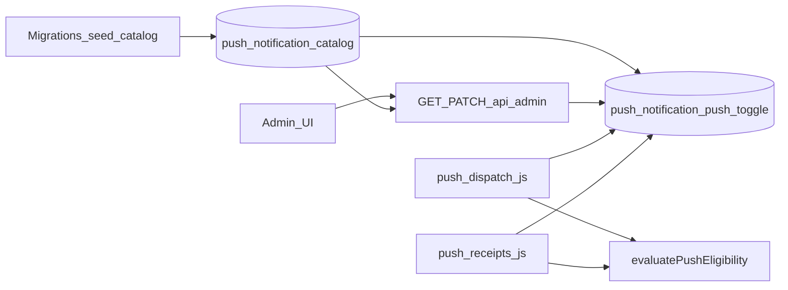

# notifs control

## Goals

- **Fixed catalog:** Only `notification_type` values present in a dedicated DB table (seeded/altered **only via migrations**) participate in push policy and appear in the admin UI.
- **Admin control:** Admins enable/disable push per catalog row via existing `/api/admin` auth (`[apps/beerbook-api/routes/admin.js](apps/beerbook-api/routes/admin.js)`).
- **Git/migrations as source of new types:** Adding a type = new migration (INSERT into catalog + seed default toggle). No admin “add type” API.
- **Preserve fail-closed behavior:** Types not in the catalog (or toggled off) do not receive push; `[apps/beerbook-api/lib/pushEligibility.js](apps/beerbook-api/lib/pushEligibility.js)` `evaluatePushEligibility` stays the single decision API; only how `resolvePushAllowlist` is built changes.

## Data model (new migration)

Add two tables (keeps “catalog” vs “runtime toggle” concerns separate and makes accidental `INSERT` of random types hard from app code if you only expose PATCH-by-key in the API):

| Table                           | Purpose                                                                                                                                                                 |
| ------------------------------- | ----------------------------------------------------------------------------------------------------------------------------------------------------------------------- |
| `push_notification_catalog`     | `notification_type` (PK), `label` (for UI), `sort_order`, optional `description`. Rows **only** via migrations.                                                         |
| `push_notification_push_toggle` | `notification_type` (PK, FK → catalog), `push_enabled` boolean NOT NULL, `updated_at` timestamptz. Seed one row per catalog row; **admins update `push_enabled` only.** |

**Initial migration content:** Seed the six types currently in `DEFAULT_PUSH_ALLOWLIST` (`[pushEligibility.js](apps/beerbook-api/lib/pushEligibility.js)` lines 1–8) with `push_enabled = true` so behavior matches production today after deploy.

**PostgREST:** Ensure tables are exposed like other app tables (same schema as existing push migrations). Add indexes only if you introduce heavy admin list queries (likely unnecessary for tiny cardinality).

Optional: a **read-only view** (e.g. `admin_push_notification_types`) that joins catalog + toggle for one GET round-trip; otherwise admin GET can use two `select=` requests or embed logic in Node.

## Backend: resolving the allowlist

Today `**[push-dispatch.js](apps/beerbook-api/scripts/push-dispatch.js)`** and `**[push-receipts.js](apps/beerbook-api/scripts/push-receipts.js)`** call synchronous `resolvePushAllowlist()` (`[pushEligibility.js](apps/beerbook-api/lib/pushEligibility.js)` lines 25–28).

Planned behavior:

1. `**fetchPushAllowlistFromDb(rest)`** (new helper, either in `pushEligibility.js` or `lib/pushAllowlistStore.js`): one PostgREST call (or RPC) returning types where `push_enabled = true`. Uses the same `rest` pattern as workers (service role).
2. `**resolvePushAllowlist({ env, dbTypes })`:** `Set(dbTypes)` merged with `**PUSH_ALLOWLIST_EXTRA`** (keep for break-glass / staged rollout, as documented in `[API_CONTRACT.md](apps/beerbook-api/docs/API_CONTRACT.md)` ~3721). Document that extras are still subject to `evaluatePushEligibility` / pair state—only types that exist in notifications matter; unknown types remain fail-closed if you choose to restrict extras to catalog-only in validation (recommended: **only allow EXTRA types that exist in `push_notification_catalog`** to avoid admins typo-ing env and expecting push).
3. **Workers:** At start of `runOnce`, `await fetchPushAllowlistFromDb(restFn)` then `resolvePushAllowlist`. Small optional in-memory TTL cache (e.g. 30–60s) inside the worker process if you want fewer reads; not required for low volume.
4. `**DEFAULT_PUSH_ALLOWLIST`:** Remove as the runtime source of truth **or** keep as **tests-only / emergency fallback** when DB returns empty after error (product choice: prefer **fail-closed** empty set + loud log on DB failure over silently pushing with stale code list).

Unit tests in `[test/push-eligibility.test.js](apps/beerbook-api/test/push-eligibility.test.js)` should pass an explicit `allowlist` into `evaluatePushEligibility` where they currently rely on the default Set, so behavior stays deterministic when defaults change.

Integration tests (`[push-dispatch.integration.test.js](apps/beerbook-api/test/push-dispatch.integration.test.js)`, `[push-receipts.integration.test.js](apps/beerbook-api/test/push-receipts.integration.test.js)`) need seed data or mocks for DB allowlist fetch.

## Admin API

In `[routes/admin.js](apps/beerbook-api/routes/admin.js)` (already `authMiddleware` + `adminMiddleware` on the router):

- `**GET /api/admin/push-notification-types`** — Returns ordered list: `notification_type`, `label`, `push_enabled`, `updated_at` (join catalog + toggle). Read-only.
- `**PATCH /api/admin/push-notification-types`** — Body e.g. `{ "toggles": { "streak_at_risk": false } }`. Validation in `[lib/adminValidation.js](apps/beerbook-api/lib/adminValidation.js)`: only keys allowed are those that **exist in catalog** (validate by prefetching catalog IDs or relying on FK + returning 400 on no-op). Updates only `push_notification_push_toggle.push_enabled` and `updated_at`.

Document in `[API_CONTRACT.md](apps/beerbook-api/docs/API_CONTRACT.md)` and align the push matrix section (~3697) with “effective allowlist = enabled catalog rows (+ optional `PUSH_ALLOWLIST_EXTRA` merge policy).”

## Admin UI (BeerBook)

- `[app.html](apps/beerbook/app.html)`: add an admin tab (e.g. “Notifications” / “Push”).
- `[admin.js](apps/beerbook/admin.js)`: follow existing `switchView` / `renderCosmeticsPanel` patterns—new `renderPushNotificationsPanel()` that loads GET, renders checkboxes per row, saves via PATCH.
- `[supabase.js](apps/beerbook/supabase.js)` (or equivalent API wrapper): add `getAdminPushNotificationTypes` / `patchAdminPushNotificationTypes`.

## Flow (high level)

## Acceptance criteria

- New types appear in the admin list **only** after a migration inserts them into `push_notification_catalog` (and toggle seed).
- Toggling off a type stops **new** push eligibility for that type; does not rewrite history in `tab_notifications`.
- Dispatch and receipt workers use the same effective allowlist semantics as today, modulo DB + optional env merge.
- Non-catalog notification types remain in-app-only (fail-closed).

## Suggested implementation order

1. Supabase migration (tables + seed + RLS consistent with other internal tables).
2. `fetchPushAllowlistFromDb` + refactor `resolvePushAllowlist`; wire `push-dispatch.js` / `push-receipts.js`.
3. Admin GET/PATCH + validation + tests.
4. API contract + frontend admin tab + client helpers.
5. Remove or narrow in-code `DEFAULT_PUSH_ALLOWLIST` usage; update unit/integration tests.

