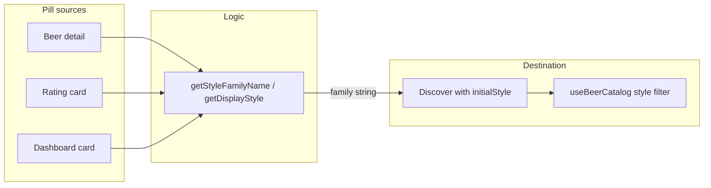

# Style family categorization plan

## Goal

- **Rating cards and browse lists**: Show and filter by **style family (category)** only. Tapping a style pill opens Discover filtered by family.
- **Beer detail**: Show **full style** and clearly indicate **style family**; the tappable pill shows family and navigates to browse by family.
- **Search**: Unchanged — user can still search for a specific style by typing; backend handles matching.

## Data and semantics

- **Beer** has `style` (full, e.g. "English Dark Mild Ale") and `style_category` (family, e.g. "Mild") from the API.
- **Rating** has only `style`; no `style_category` in the app today. Family will be **derived** from `style` when missing.

So we need a single helper that returns “family” whether we have a category or not: **use `style_category` when present, otherwise derive from `style` using keyword rules**.

## Implementation

### 1. Add family derivation in [src/utils/beerStyleColors.ts](src/utils/beerStyleColors.ts)

- Add a **family label** to each keyword group in `STYLE_FAMILIES` (e.g. `familyLabel: 'IPA'`, `'Stout'`, `'Mild'`, `'English Ale'`, `'Pale Ale'`, etc.). Align with [DiscoverScreen’s STYLE_FILTER_OPTIONS](src/screens/discover/DiscoverScreen.tsx) (IPA, Pale Ale, Lager, Stout, Porter, Wheat, Pilsner, Sour, Belgian) and add labels for the “English / Strong Ale” group (e.g. “Mild” for mild ale, “English Ale” for the rest of that block).
- Add `**getStyleFamilyName(style: string, styleCategory?: string | null): string`**:
  - If `styleCategory` is non-empty, return it.
  - Else match `style` (lowercased) against each group’s keywords (same logic as `getStyleFamilyColor`) and return that group’s `familyLabel`.
  - Fallback: return `style` so we never show empty.
- Change `**getDisplayStyle(beer)`** to return **family** instead of “category else style”:
  - Implement as `return getStyleFamilyName(beer.style ?? '', beer.style_category)`.
  - All existing call sites (StyleBadge, BeerDetailScreen, BeerCard, DiscoverScreen) will then show **family** for the pill / list style text.

No change to `getStyleFamilyColor`; it can keep using the same keyword list (and can later use `familyLabel` for consistency if desired).

### 2. Rating cards: show and navigate by family

- **[src/components/ratings/RatingCard.tsx](src/components/ratings/RatingCard.tsx)**  
  - Import `getStyleFamilyName` from `beerStyleColors`.
  - Rating has no `style_category`, so use `**getStyleFamilyName(rating.style)`** for both:
    - **Pill label**: `label={getStyleFamilyName(rating.style)}`.
    - **onPress**: `onStylePress(getStyleFamilyName(rating.style))`.
  - So the pill shows family and Discover opens with that family as the filter.

No API or type change required for Rating; derivation is client-side.

### 3. Beer detail: full style + family, pill = family

- **[src/screens/browse/BeerDetailScreen.tsx](src/screens/browse/BeerDetailScreen.tsx)**  
  - Keep using **StyleBadge** with `style={beer!.style ?? ''}` and `styleCategory={beer!.style_category}`. StyleBadge already uses `getDisplayStyle` for the label and passes that to `onPress`; once `getDisplayStyle` returns family, the pill will show family and navigate with family.
  - **Layout**: Show **full style** clearly and that it’s in a family:
    - When `beer.style` is present: show it as the primary style text (e.g. “English Dark Mild Ale”).
    - Show the **family pill** (StyleBadge) next or below; it already displays family after step 1.
    - Remove or simplify the current “secondary style” logic that only showed full style when it differed from category; replace with a single clear pattern: “Full style: X” and a family pill “Y” that links to browse by Y.
  - Ensure the pill still calls `handleStylePress` with the same value it displays (family), so no change to `handleStylePress` signature; it already receives the string from StyleBadge and passes it to `navigateToStyleBrowse`.

### 4. StyleBadge and other pill call sites

- **[src/components/beer/StyleBadge.tsx](src/components/beer/StyleBadge.tsx)**  
  - Keep using `getDisplayStyle({ style, style_category })` for the pill label and pass that to `onPress(label)`. After step 1, that value is family, so no API change; behavior is “show family, navigate with family.”
- **DashboardActivityCard** uses StyleBadge with `style={rating.style}` and no `styleCategory`; after step 1, `getDisplayStyle` will return derived family, so it will show and pass family. No change needed there.

### 5. Browse / Discover

- **Catalog filter**: Discover already uses `route.params?.initialStyle` and passes it to `useBeerCatalog({ style: initialStyle })`. Once all style-pill navigation passes **family** (from RatingCard, StyleBadge on BeerDetail and DashboardActivityCard), `initialStyle` will be a family string and the catalog will be filtered by family. No change required in [src/screens/discover/DiscoverScreen.tsx](src/screens/discover/DiscoverScreen.tsx) or [src/utils/navigateToStyle.ts](src/utils/navigateToStyle.ts).
- **Search**: Leave as-is; `useBeerSearch(debouncedSearch)` and backend handle free-text search (including specific style names).

### 6. Lists that show style (BeerCard, Discover trending)

- **[src/components/beer/BeerCard.tsx](src/components/beer/BeerCard.tsx)** and **DiscoverScreen** trending cards use `getDisplayStyle(beer)` for the style line. After step 1 they will show family only, which matches “browse lists categorized by family.” No further change.

## Flow summary

- **Pill label** everywhere: family (from API `style_category` or derived via `getStyleFamilyName(style)`).
- **Pill onPress** → `navigateToStyleBrowse(nav, family)` → Discover → `useBeerCatalog({ style: family })`.
- **Beer detail** additionally shows full `beer.style` as primary style text.

## Backend assumption

The catalog endpoint `GET /api/catalog/browse?style=...` is assumed to filter by **style_category** (or a family/tag that matches these labels). If it currently does exact match on `style` only, the backend should be updated to filter by family/category when the value is one of the known family labels (or to accept both style and style_category semantics). That is out of scope for this mobile-only plan but should be verified for “no results” to go away.

## Files to touch

| File                                                                               | Change                                                                                                                                         |
| ---------------------------------------------------------------------------------- | ---------------------------------------------------------------------------------------------------------------------------------------------- |
| [src/utils/beerStyleColors.ts](src/utils/beerStyleColors.ts)                       | Add `familyLabel` to each STYLE_FAMILIES entry; add `getStyleFamilyName`; make `getDisplayStyle` return family via `getStyleFamilyName`.       |
| [src/components/ratings/RatingCard.tsx](src/components/ratings/RatingCard.tsx)     | Use `getStyleFamilyName(rating.style)` for TagPill label and for `onStylePress`.                                                               |
| [src/screens/browse/BeerDetailScreen.tsx](src/screens/browse/BeerDetailScreen.tsx) | Adjust layout to show full style as primary and family pill; keep StyleBadge and `handleStylePress` as-is (they will use family after step 1). |

No changes to navigation, DiscoverScreen, navigateToStyle, or type definitions for Rating/Beer.