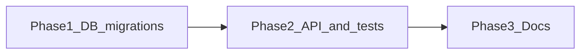

# YG (`yg_value`) half-steps — backend plan

## Implementation phases (context-friendly execution)

Do work in this **order**. Each phase fits roughly one focused agent/chat pass so you do not blow the context window.

| Phase | Scope | Deliverables |
| ----- | ----- | ------------ |
| **Phase 1 — Database** | Supabase migrations only | New migration(s): backfill `yg_value` (legacy → canonical), `UPDATE ratings SET rating` from locked linear star formula, replace `ratings_yg_value_check`, column comment; achievement row for `first_one_star` (rule `yg_value eq -1`, copy “Give a negative review”) via migration and/or seed update. Optional: split **1a** = ratings backfill + CHECK, **1b** = achievements only (two small files). |
| **Phase 2 — API + tests** | Node + verification | `[ratingsValidation.js](apps/beerbook-api/lib/ratingsValidation.js)` half-grid + epsilon; `ygValueToStarRating` = §1 formula; `[server.js](apps/beerbook-api/server.js)` error strings; `[ratings-yg-value.test.js](apps/beerbook-api/test/ratings-yg-value.test.js)` updated; run test suite; smoke **verify-aggregates** (leaderboard, profile stats, `/api/beers?sort=avg_yg_value`) against env with migrated DB. |
| **Phase 3 — Docs** | Contract + internal docs | `[API_CONTRACT.md](apps/beerbook-api/docs/API_CONTRACT.md)` (allowed set, errors, rounding, analytics appendix); architecture-scan; `[DATABASE_SCHEMAS_OVERVIEW.md](apps/beerbook-api/docs/DATABASE_SCHEMAS_OVERVIEW.md)`; `[DECISIONS.md](DECISIONS.md)` / `[YG_BIDIRECTIONAL_PRODUCT_DECISIONS.md](apps/beerbook-api/docs/YG_BIDIRECTIONAL_PRODUCT_DECISIONS.md)` as needed. |

**Deploy sequence:** apply **Phase 1** on DB → ship **Phase 2** API so new writes validate correctly on the new grid → **Phase 3** can ship with the same release or immediately after. Mobile half-steps should assume **Phase 1 + 2** are live.

---

## Current state (from repo)

| Layer                           | Today                                                                                                                                                                                                                                                                                                                                                                                                                                  |
| ------------------------------- | -------------------------------------------------------------------------------------------------------------------------------------------------------------------------------------------------------------------------------------------------------------------------------------------------------------------------------------------------------------------------------------------------------------------------------------- |
| **API validation**              | `[apps/beerbook-api/lib/ratingsValidation.js](apps/beerbook-api/lib/ratingsValidation.js)` — integers only, set `-6..-1, 1..7`, rejects non-integers (e.g. `3.5`).                                                                                                                                                                                                                                                                     |
| **POST/PATCH**                  | `[apps/beerbook-api/server.js](apps/beerbook-api/server.js)` — uses `validateYgValue`; requires `yg_value` on POST; derives internal `rating` via `ygValueToStarRating`. Error strings still say “integer -6 to 7”.                                                                                                                                                                                                                    |
| **DB CHECK (latest migration)** | `[apps/beerbook-api/supabase/migrations/20260317100000_ratings_yg_value_neg6_to_7_no_zero.sql](apps/beerbook-api/supabase/migrations/20260317100000_ratings_yg_value_neg6_to_7_no_zero.sql)` — `NULL` or `-6..7`, `!= 0`. **Does not allow `10` as max if typed integer elsewhere**, but allows legacy negatives down to `-6`.                                                                                                         |
| **Column type**                 | Canonical doc `[apps/beerbook/docs/database-schema.sql](apps/beerbook/docs/database-schema.sql)` uses `DECIMAL(3,1)` for `yg_value` — **already suitable for half-steps** (`-1`, `10.0`). Confirm live Supabase column type; if it were `integer`, plan `ALTER COLUMN ... TYPE numeric(4,1)` (or `decimal(3,1)` if sufficient).                                                                                                        |
| **Contract docs**               | `[apps/beerbook-api/docs/API_CONTRACT.md](apps/beerbook-api/docs/API_CONTRACT.md)` still documents integer `-6..7`. `[DATABASE_SCHEMAS_OVERVIEW.md](apps/beerbook-api/docs/DATABASE_SCHEMAS_OVERVIEW.md)` is stale (`-6..6`). No OpenAPI YAML found; **API_CONTRACT.md is the contract surface**.                                                                                                                                      |
| **Aggregates**                  | `[apps/beerbook-api/supabase/migrations/20260309000000_phase4_aggregation_rpcs.sql](apps/beerbook-api/supabase/migrations/20260309000000_phase4_aggregation_rpcs.sql)` — `sum(yg_value::numeric)`, `avg(yg_value)` — **already numeric-safe**. Leaderboard “top YG” uses sums.                                                                                                                                                         |
| **List/sort**                   | `[apps/beerbook-api/routes/beers.js](apps/beerbook-api/routes/beers.js)` — `sort` whitelist includes `avg_yg_value` against `beer_averages` view — averages continue to work with fractional inputs.                                                                                                                                                                                                                                   |
| **Achievements**                | Seed `[apps/beerbook-api/supabase/seed/2026marchachievements.sql](apps/beerbook-api/supabase/seed/2026marchachievements.sql)`: `first_one_star` uses `yg_value <= -2`; **on the new scale the only negative is `-1`**, so this rule never fires unless updated (e.g. `eq -1` or `lte -1`). `[achievementProgress.js](apps/beerbook-api/lib/achievementProgress.js)` PostgREST filters (`gte`/`lte`/`eq`) accept decimals (e.g. `4.5`). |

**Gap vs. product spec:** Allowed set should be `**-1` ∪ `{ x | 1 ≤ x ≤ 10, 2x ∈ ℤ }`**. Existing DB rows and API allow `**-6..-2`**, `**7**`, and **no positive half-steps** — tightening CHECK without a data step will fail.

---

## 1. Product decisions (locked)

| Topic                                               | Decision                                                                                                                                                                                                                                                                                                                                                                                                                           |
| --------------------------------------------------- | ---------------------------------------------------------------------------------------------------------------------------------------------------------------------------------------------------------------------------------------------------------------------------------------------------------------------------------------------------------------------------------------------------------------------------------- |
| **Legacy rows**                                     | **Backfill** to canonical scale in the same migration as the new CHECK (not historical-only).                                                                                                                                                                                                                                                                                                                                      |
| **Achievement `first_one_star` (“Brutal Honesty”)** | Product copy: **“Give a negative review”**. Rule: unlock when user submits a rating with `**yg_value = -1`** (use JSON `{"type":"comparison","field":"yg_value","op":"eq","value":-1}` or `lte` with `-1` — equivalent on this scale). Update name/description in seed + any migration that patches existing `user_achievements` / achievement defs as needed.                                                                     |
| **Internal `rating` (1–5) from YG**                 | `**ygValueToStarRating`:** monotone map from canonical YG to integer stars — **linear:** `rating = clamp(1, round(1 + (yg + 1) * 4 / 11), 5)` for `yg` in `[-1, 10]` (half-steps snap to nearest star bucket at boundaries via `round`). `-1 → 1`, `10 → 5`, mid-scale e.g. `4.5 → 3`. Implement in JS; mirror in SQL migration `**UPDATE ratings SET rating = ...`** after `yg_value` backfill so `ratings.rating` stays aligned. |
| **Analytics / runbook**                             | **Approved:** document migration cutoff, legacy→canonical table, and post-migration interpretation of sums/averages in API_CONTRACT appendix and/or [YG_BIDIRECTIONAL_PRODUCT_DECISIONS.md](apps/beerbook-api/docs/YG_BIDIRECTIONAL_PRODUCT_DECISIONS.md).                                                                                                                                                                         |

**Backfill mapping (rows):**

- `yg_value IN (-6,-5,-4,-3,-2) → -1`.  
- `-1 → -1`.  
- Legacy positives `1..7 → 1 + (yg_old - 1) * 1.5` → `1, 2.5, 4, 5.5, 7, 8.5, 10`.  
- Then `**UPDATE ratings SET rating = ...`** using the formula above (per row from new `yg_value`).

---

## 2. Schema / migration

**New migration** (timestamp after `20260317100000`), e.g. `..._ratings_yg_value_canonical_half_steps.sql`:

1. **Pre-check:** `SELECT yg_value, count(*) FROM ratings WHERE yg_value IS NOT NULL GROUP BY 1 ORDER BY 1;` (manual or logged in migration comment).
2. **Optional column alter:** only if live type is integer → `numeric(4,1)` (or align with `DECIMAL(3,1)` if confirmed).
3. **Backfill:** `UPDATE ratings SET yg_value = ... CASE ... END` for non-null legacy values; then `UPDATE ratings SET rating = ...` from §1 star formula for affected (or all non-null `yg_value`) rows.
4. **Replace CHECK** `ratings_yg_value_check`:
  - Allow `NULL` unchanged (if product still allows null on old rows; **POST currently requires** `yg_value` — nullable column is for legacy/import).
  - Allow `(yg_value = -1)` **or** `(yg_value >= 1 AND yg_value <= 10 AND half-step)`.
   **Half-step in PostgreSQL** (exact for `numeric`): e.g.  
   `(round(yg_value * 2) = yg_value * 2)`  
   or `(mod(yg_value * 2, 1) = 0)` on numeric — verify on target Postgres version.
   **Reject 0 explicitly:** `yg_value != 0` (or rely on disjunct form).
5. **Comment** on column: canonical scale text + pointer to API_CONTRACT.
6. **Achievements:** migration or seed patch — `first_one_star`: rule `**yg_value eq -1`**, copy **“Give a negative review”**; re-test unlocks for existing vs new users.

---

## 3. Server validation

**File:** `[apps/beerbook-api/lib/ratingsValidation.js](apps/beerbook-api/lib/ratingsValidation.js)`

- Replace integer-only logic with:
  - Finite number; reject `NaN` / `Infinity`.
  - Reject `0`.
  - If `value === -1` → valid.
  - Else require `1 <= value <= 10` and **half-step**: e.g. `Math.abs(value * 2 - Math.round(value * 2)) < EPS` (EPS ~ `1e-9`, document why).
  - Optionally **normalize** to one decimal place for storage: `Math.round(value * 2) / 2` **only** when within epsilon of grid (avoids `3.499999999` quirks); avoids silent acceptance of bad values if far from grid.
- Update `**YG_ERROR`** and any **required** message in `server.js` (`yg_value is required (...)`) to describe the new rule in one line.

`**ygValueToStarRating`:** use **locked linear formula** from §1: `clamp(1, round(1 + (yg + 1) * 4 / 11), 5)` for canonical `yg` in `[-1, 10]`. Internal-only; API_CONTRACT note that clients must not infer stars from YG.

---

## 4. Batch / import paths

- **No separate bulk import handler** found in API beyond normal POST and historic SQL migrations (`[20260316100000_ratings_yg_bidirectional_and_source.sql](apps/beerbook-api/supabase/migrations/20260316100000_ratings_yg_bidirectional_and_source.sql)`).
- **Direct PostgREST** to `ratings` (if any scripts bypass Node) will be constrained by the new CHECK — document that importers must send canonical values.
- If future CSV/admin import exists, reuse the same validation helper (extract shared function if needed).

---

## 5. API contract and rounding (Phase 5–7 alignment)

**Update `[apps/beerbook-api/docs/API_CONTRACT.md](apps/beerbook-api/docs/API_CONTRACT.md)`:**

- `**yg_value` / `ygValue`:** type `number`; allowed set in plain language + formal rule (`2x ∈ ℤ` on `[1,10]` or `-1`).
- **Backward compatibility:** integer subset **is valid** when it lies on the grid (`1,2,…,10`) and `-1`; clarify **invalid** integers **none** in range (all integers 1–10 are valid).
- **Errors:** `400` `{ "error": "<same string as YG_ERROR>" }` (and “required” variant for POST).
- **Rounding section:** While backend was int-only, clients may have rounded halves → ints; **once half-precision is live**, send decimals **as-is**; **server does not round** off-grid values into compliance (reject). Avoid contradictory “round then validate” rules between client and server.

**Also refresh:** `[apps/beerbook-api/docs/architecture-scan/04-api-by-domain.md](apps/beerbook-api/docs/architecture-scan/04-api-by-domain.md)`, `[03-domain-logic.md](apps/beerbook-api/docs/architecture-scan/03-domain-logic.md)`, `[DATABASE_SCHEMAS_OVERVIEW.md](apps/beerbook-api/docs/DATABASE_SCHEMAS_OVERVIEW.md)`, and `[DECISIONS.md](DECISIONS.md)` if it still claims `0–12` for YG.

**Analytics note (required per product):** Short appendix in `API_CONTRACT.md` and/or `YG_BIDIRECTIONAL_PRODUCT_DECISIONS.md`: migration cutoff, legacy→canonical mapping table, how leaderboard sums and beer `avg_yg_value` should be read post-migration.

---

## 6. Aggregates / search verification

- **SQL:** Re-read `leaderboard_aggregate` and profile stats in `[20260309000000_phase4_aggregation_rpcs.sql](apps/beerbook-api/supabase/migrations/20260309000000_phase4_aggregation_rpcs.sql)` — no code change expected; **smoke-test** with seeded fractional rows after migration.
- **HTTP:** `GET /api/beers` with `sort=avg_yg_value`; `GET /api/leaderboard`; `GET /api/activity` paths that surface `avg_yg_value` — confirm JSON numbers serialize as decimals (Node/PostgREST typically fine).
- `**headToHead` / filters:** `[apps/beerbook-api/lib/headToHead.js](apps/beerbook-api/lib/headToHead.js)` already uses `Number(yg_value)` — OK.

---

## 7. Tests

**Update `[apps/beerbook-api/test/ratings-yg-value.test.js](apps/beerbook-api/test/ratings-yg-value.test.js)`:**

- Accept: `-1`, `1`, `1.5`, `10`, `9.5`; reject: `0`, `-2`, `10.5`, `4.25`, `3.14159`.
- Epsilon edge cases: value very close to half-step.
- `ygValueToStarRating` cases for new fractional inputs.

---

## Dependency / ordering

Same as **Implementation phases** above. Mermaid:

Mobile half-steps: **Phase 1 + Phase 2** live → clients send halves as-is (no int-only double-rounding).