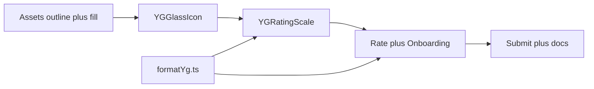

# YG rating scale — full implementation plan

## Goals

- **Allowed values:** `-1` **or** any `1 + k·0.5` for `k = 0..18` → `**1, 1.5, …, 9.5, 10`**. `**0` forbidden.** **No `-1.5`**, no `10.5`.
- **Halves:** Only on the **positive** side. `**-1`** is a single discrete “BAD” state (no fill percent, no half).
- **UI:** 11 **slots** in a row: slot `0` = `-1`; slots `1–10` = integer labels `1–10` with **fill level** encoding the fractional part on the active glass.
- **Fill:** Real “half full” via **cropping the beer fill layer only** (not whole-glass scale, not opacity tricks). **No duplicate assets** for half states.
- **Assets:** **PNG or SVG** — same architecture: **outline layer + fill-only layer** for the GOOD glass; BAD and NEUTRAL can stay single images.

## Allowed set (formal)

```text
Valid = { -1 } ∪ { x ∈ ℝ | 1 ≤ x ≤ 10 and 2x ∈ ℤ }
```

Validate with: integer check on `value * 2` after range checks; reject `0`; use small epsilon if needed for float noise.

## Current codebase


| Area             | File(s)                                                                                                                                |
| ---------------- | -------------------------------------------------------------------------------------------------------------------------------------- |
| Slider (replace) | [src/components/ratings/YGSlider.tsx](src/components/ratings/YGSlider.tsx) — PNG grid, 13 integer steps                                |
| Scale utilities  | [src/utils/formatYg.ts](src/utils/formatYg.ts) — `-6..-1`, `1..7`                                                                      |
| Rate flow        | [src/screens/rate/RateScreen.tsx](src/screens/rate/RateScreen.tsx)                                                                     |
| Onboarding       | [src/screens/onboarding/OnboardingRateScreen.tsx](src/screens/onboarding/OnboardingRateScreen.tsx)                                     |
| Display only     | `formatYgDisplay` in RatingCard, DraftCard, Profile, DashboardActivityCard, SwipeableCardWrapper                                       |
| Types / drafts   | [src/types/api.ts](src/types/api.ts), [src/types/models.ts](src/types/models.ts), [src/stores/draftStore.ts](src/stores/draftStore.ts) |


**Runtime:** `react-native-svg` already in package.json; PNG fill clip can use plain `View` + `overflow: 'hidden'` + bottom-aligned `Image` if you skip SVG for the fill.

---

## Phase 1 — Assets

1. **GOOD glass (two layers)**
  - **Outline:** rim/glass stroke (transparent interior or masked so fill shows through).  
  - **Fill:** amber liquid **only**, aligned to the same pixel box as outline.  
  - Optional **foam** layer above fill (clip with fill or sit above—design choice).
2. **BAD glass (`-1`)**
  - Single asset (e.g. current `bad_beer` style), no fill logic.
3. **NEUTRAL**
  - Outline / muted glass for “empty” positive slots or pre-selection if you ever use `null` (product default today is `1`; likely **empty good glasses** = `fillPercent 0` with outline only).
4. Export **@2x/@3x** if PNG; one **master aspect ratio** for all three states so layout math is stable.

**Deliverable:** files under `assets/images/` (e.g. `yg_good_outline.png`, `yg_good_fill.png`, …) or `src/components/ratings/assets/` + optional SVG modules.

---

## Phase 2 — `YGGlassIcon`

**New file:** e.g. `src/components/ratings/YGGlassIcon.tsx`

**Props**


| Prop          | Type       | Behavior                         |
| ------------- | ---------- | -------------------------------- |
| `state`       | `'neutral' | 'positive'                       |
| `fillPercent` | `0..1`     | **Ignored** when `negative`      |
| `isActive`    | `boolean`  | Slight scale or outline emphasis |
| `size`        | `number`   | Width/height for layout          |


**Behavior**

- `**negative`:** render BAD asset only.  
- `**neutral`:** NEUTRAL / outline-only per design.  
- `**positive`:** stack **outline** + **cropped fill**:  
  - **PNG:** wrapper height `fillPercent * H`, `overflow: 'hidden'`, fill `Image` height `H`, `align` to **bottom** of wrapper.  
  - **SVG:** `ClipPath` / `Mask` rect height `fillPercent * viewBoxHeight`, anchored to **bottom**.

**Constraints:** Do not scale the **entire** composed icon to simulate fill. Do not use opacity to fake half levels.

---

## Phase 3 — `YGRatingScale`

**New file:** e.g. `src/components/ratings/YGRatingScale.tsx`

**Props:** `value: number`, `onChange: (v: number) => void` (align with `YG_DEFAULT` when unset—same as today).

**Layout**

- **11** columns: index `0` → `-1` (BAD); `1..10` → GOOD glasses for ratings `1..10`.
- Slightly **larger** icon size than today; **tighter** horizontal gap; test on narrow devices.

**Fill derivation** (for `value > -1`)

Let `f = Math.floor(value)`, `frac = value - f` (expect `0` or `0.5`).

For column `i` in `1..10` (representing rating `i`):

- `i < f` → `fillPercent = 1`  
- `i > f` → `fillPercent = 0`  
- `i === f` → `fillPercent = frac`

For `value === -1`: column `0` = **negative** state; columns `1..10` = empty positive (`fillPercent = 0`) with outline.

**Active glass:** emphasize column for `f` when `value >= 1`, or column `0` when `value === -1`.

**Gestures (row-level)**

- Use `GestureDetector` + `Gesture.Pan()` (and tap) on the **row**, not only on each icon—large hit target.
- Map `x` position → **index `0..10*`* and **half** for positives:
  - **Option A:** within each positive column, **left half** = `.0`, **right half** = `.5`.  
  - **Option B:** continuous `x` → real number → snap to nearest valid step in `[-1, 1, 1.5, …, 10]`.
- `**-1`:** only when touch maps to **far-left column** (index `0`); no half blending into `-1`.

**Haptics:** light impact on step change (reuse `expo-haptics` patterns from `YGSlider`).

**Label:** reuse `formatYgDisplay(value)` under the row; support halves (e.g. `4.5 YG`).

---

## Phase 4 — `formatYg.ts`

- Replace old negative/positive integer lists with:
  - `YG_MIN_POSITIVE = 1`, `YG_MAX_POSITIVE = 10`, `YG_NEGATIVE = -1`
  - `isYgInAllowedSet(v)`: `-1` or `(1..10` and half-step`)`  
  - `formatYgDisplay`: `-1` → `-1 YG`; positives: show **no decimal** for integers, **one decimal** for `.5` only  
  - Optional: `snapYgToValidStep(n: number): number` for gesture end  
  - Optional: `normalizeYgForApi(v: number): number` — `Math.round(v * 2) / 2` then clamp; if API int-only: `Math.round(v)` until backend ships
- Remove or stop exporting `indexToYgValue` / `YG_SLIDER_LENGTH` / old `-6..7` helpers once `YGRatingScale` owns mapping.

**Default:** keep `YG_DEFAULT = 1` unless product wants `null` + neutral.

---

## Phase 5 — Types, drafts, submission

- Update JSDoc on `yg_value` in [src/types/api.ts](src/types/api.ts) and [src/types/models.ts](src/types/models.ts).
- [src/stores/draftStore.ts](src/stores/draftStore.ts): drafts store `number`; validation when loading drafts uses new `isYgInAllowedSet`.
- [src/screens/rate/RateScreen.tsx](src/screens/rate/RateScreen.tsx): validation + payload use new rules; optional `normalizeYgForApi` right before `createRating` / `updateRating` if needed.
- **Hooks/API:** [src/hooks/useRatings.ts](src/hooks/useRatings.ts) / [src/api/ratings.ts](src/api/ratings.ts) — ensure body sends JSON number (halves allowed when backend ready).

---

## Phase 6 — Screen integration

- Replace `YGSlider` with `YGRatingScale` in Rate + Onboarding screens.
- [RatingScreenWalkthrough](src/components/ratings/RatingScreenWalkthrough.tsx) step 1 copy: mention **-1 to 10** and **half steps** if needed.
- Deprecate [src/components/ratings/YGSlider.tsx](src/components/ratings/YGSlider.tsx) (delete or thin re-export to `YGRatingScale` during transition).

---

## Phase 7 — Backend and docs

- Coordinate API + DB:
  - If `yg_value` is **integer-only**: document client rounding and plan migration to `numeric`/half support.
  - If already **float**: document allowed range and rejection of `0`/out-of-range.
- Update [docs/backend_references/API_CONTRACT.md](docs/backend_references/API_CONTRACT.md) (and [docs/API_CONTRACT_MOBILE.md](docs/API_CONTRACT_MOBILE.md) if present) to match.
- **Historical data:** old ratings may be on legacy int scales; averages can mix until backfill—document product/analytics caveat if needed.

---

## QA checklist

- `4` vs `4.5`: only **one** glass shows half fill; crisp clip.  
- `-1`: BAD art only; no partial fill; dragging from `1` to left hits `-1` only in first slot.  
- No `0` selectable; validation blocks invalid floats (e.g. `4.25`).  
- Submit/update rating with `9.5` and `10`.  
- Draft offline path preserves half if backend accepts it.  
- Share text and feed cards show `formatYgDisplay` correctly.  
- Narrow phone: 11 glasses still tappable and readable.

---

## Implementation order




**Suggested sequence:** assets → `YGGlassIcon` → `formatYg.ts` → `YGRatingScale` → screen swap → API normalization + docs → QA.