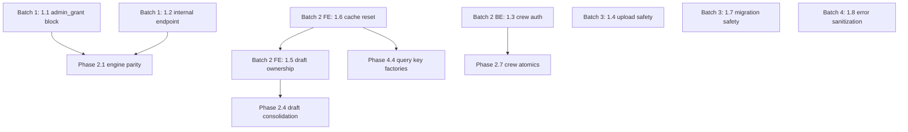

# Phase 1 Execution Plan

## Phase 1 Overview

Phase 1 closes privilege escalation, auth boundary holes, and data safety gaps across 8 work items (BE-B-01, BE-B-02, BE-A-01, BE-C-01, BE-D-01, INT-03, BE-F-01, BE-F-05, BE-F-08, INT-14, FE-E-02, FE-J-01, BE-H-05, BE-B-03). Nothing else ships safely until these are resolved. Two items are actively exploitable now (admin_grant and upload bypass).

The plan is organized into 4 sequential batches. Batches are sequenced for root-cause-first execution, but within each batch, backend and frontend tracks run in parallel.

---

## Repo Ownership Summary

- **Backend-only:** 1.1, 1.2, 1.3, 1.4, 1.7, 1.8 (6 items)
- **Frontend-only:** 1.5, 1.6 (2 items)
- **Coordinated:** None within Phase 1 (1.3 adds new 403s that frontend will encounter, but frontend error handling is deferred to Phase 2)

---

## Batch 1: Critical Exploit Closure

**Priority:** IMMEDIATE -- actively exploitable vulnerabilities
**Repo:** Backend-only
**Items:** 1.1, 1.2

### 1.1 -- Block `admin_grant` Privilege Escalation

- **Root cause:** No admin-role authorization check in process-event handlers for `admin_grant` event type. Any authenticated JWT can mint arbitrary Tabs.
- **Issues resolved:** BE-B-01 (Critical)
- **Arch risk addressed:** ARCH-01 (dual-runtime drift) -- fix MUST be applied to both Node (`routes/internal.js`, `lib/processEventEngine.js`) and Edge (`supabase/functions/process-event/index.ts`, `engine.ts`)
- **Files:** `routes/internal.js`, `lib/processEventEngine.js`, `supabase/functions/process-event/index.ts`, `engine.ts`
- **Action:**
  - Add admin-role check (e.g., `claims.role === 'admin'` or allowlist) to both Node and Edge `process-event` handlers for `admin_grant`
  - Reject non-admin callers with `403`
- **Validation:**
  - Test: non-admin JWT + `event_type=admin_grant` returns 403 (both Node and Edge)
  - Test: admin JWT + `event_type=admin_grant` succeeds with idempotent ledger mutation
  - Test: other event types unaffected by new gate
- **Contract/doc update:** Document `admin_grant` authorization requirement in API_CONTRACT_SCHEMA_AUDIT.md

### 1.2 -- Close Internal Endpoint Fail-Open

- **Root cause:** `INTERNAL_PROCESS_EVENT_SECRET` not required at startup; `/internal` routes mounted outside rate limiter
- **Issues resolved:** BE-B-02 (High), BE-A-01 (High)
- **Files:** `routes/internal.js`, `server.js`
- **Action:**
  - Make `INTERNAL_PROCESS_EVENT_SECRET` required at startup; refuse to mount `/internal/process-event` if unset
  - Add dedicated rate limiter to `/internal` routes (stricter than `/api`)
- **Validation:**
  - Test: server startup without secret refuses to mount internal routes (or fails to start)
  - Test: internal endpoint rejects requests without valid secret
  - Test: rate limiter applies to `/internal` routes
- **Contract/doc update:** Document required env vars in deployment runbook

**Phase 2 gate:** Batch 1 unblocks Phase 2.1 (Node/Edge engine parity) -- parity tests should run against secured engine.

---

## Batch 2: Authorization + Auth Boundary Hardening

**Priority:** HIGH -- data exposure and cross-account leakage
**Repo:** Parallel backend + frontend tracks
**Items:** 1.3 (backend), 1.5 + 1.6 (frontend, ship together)

### 1.3 -- Enforce Crew Membership Authorization (Backend)

- **Root cause:** Crew-scoped feeds (ratings, activity, stats) accept arbitrary `crew_id` without membership validation, despite crew detail routes enforcing it -- inconsistent authorization policy
- **Issues resolved:** BE-C-01 (High), BE-D-01 (High), INT-03 (High)
- **Files:** `server.js`, `routes/activity.js`, `routes/crews.js`
- **Action:**
  - Create shared `requireCrewMembership(userId, crewId)` middleware/guard
  - Apply to `GET /api/ratings?feed=crew`, `GET /api/activity?feed=crew`, `GET /api/stats?crew_id`
  - Return 403 for non-members
- **Validation:**
  - Test: non-member + crew-scoped ratings/activity/stats returns 403
  - Test: member access returns data as before
  - Test: crew detail endpoint behavior unchanged
- **Contract/doc update:** Document 403 response for crew-scoped endpoints in API contract
- **Cross-repo note:** Frontend currently does not expect 403 on these endpoints. After this lands, frontend users who somehow reach crew data without membership will see errors. This is correct behavior. Graceful frontend error handling is deferred to Phase 2.

### 1.6 -- Add Auth-Boundary Query Cache Reset (Frontend)

- **Root cause:** Singleton `QueryClient` not cleared on logout; "me" queries use global keys without user scope; previous-account data flashes on profile/tabs/feed after account switch
- **Issues resolved:** FE-J-01 (High)
- **Files:** `App.tsx`, `stores/authStore.ts`
- **Action:**
  - On `logout()`, call `queryClient.clear()` or selectively remove all user-scoped query keys
  - Migrate "me" queries to include user-id scope in cache keys: `['tabs', 'profile', userId]`, `['my-crews', userId]`, etc.
- **Validation:**
  - Test: logout then login as different user shows no stale profile/tabs/feed data
  - Test: cache keys include userId after migration
- **Contract/doc update:** Document internal query key convention for team reference

### 1.5 -- Fix Cross-Account Draft Leakage (Frontend)

- **Root cause:** Persisted drafts have no owner scope; not cleared on logout; can submit under wrong user after account switch
- **Issues resolved:** FE-E-02 (High), related: FE-J-01 (High)
- **Files:** `stores/draftStore.ts`, `stores/authStore.ts`, `hooks/useDraftSync.ts`
- **Dependency:** Ships WITH 1.6 (auth boundary cache reset)
- **Action:**
  - Add `owner_user_id` field to draft schema
  - Filter draft sync to only process drafts owned by current authenticated user
  - Clear or partition drafts on logout/auth transition
- **Validation:**
  - Test: user A creates draft, logout, login user B, draft does not auto-submit for user B
  - Test: drafts are scoped by owner after schema change
  - Test: logout clears/partitions drafts
- **Contract/doc update:** None (client-side only)

**Phase 2 gates:**

- 1.3 unblocks Phase 2.7 (crew mutations atomic)
- 1.5 unblocks Phase 2.4 (draft sync consolidation)
- 1.6 unblocks Phase 4.4 (query key factories)

---

## Batch 3: Data Safety

**Priority:** HIGH -- content validation bypass and destructive migration risk
**Repo:** Backend-only
**Items:** 1.4, 1.7

### 1.4 -- Fix Upload Content Validation

- **Root cause:** Upload acceptance uses extension-OR-MIME (not AND); no magic-byte verification; unsanitized JWT `sub` in filenames; no UPLOAD_DIR startup validation
- **Issues resolved:** BE-F-01 (High), BE-F-05 (Medium), BE-F-08 (Medium), INT-14 (High)
- **Files:** `routes/upload.js`, `server.js`
- **Action:**
  - Change `fileFilter` to require extension AND MIME match
  - Add post-upload magic-byte verification (JPEG/PNG/WebP/HEIC signatures)
  - Sanitize `req.claims.sub` to `[a-zA-Z0-9_-]` before use in filenames
  - Add startup `UPLOAD_DIR` validation: resolve realpath, require approved base prefix, fail fast
  - Add `X-Content-Type-Options: nosniff` and forced-download headers for non-image MIME on static serving
- **Validation:**
  - Test: file with mismatched extension/MIME is rejected
  - Test: file with correct extension/MIME but wrong magic bytes is rejected
  - Test: JWT sub with special characters produces safe filename
  - Test: startup with invalid UPLOAD_DIR fails fast
  - Test: served files include `nosniff` header
- **Contract/doc update:** Document accepted upload formats and validation in API contract

### 1.7 -- Destructive Migration Safety

- **Root cause:** Unconditional `TRUNCATE ... CASCADE` across user tables in standard migration with no environment check
- **Issues resolved:** BE-H-05 (High)
- **Files:** `supabase/migrations/20260306_ledger_migration_reset.sql`
- **Action:**
  - Move destructive SQL out of standard migration flow into manual runbook script
  - Add environment guard (`DO $$ BEGIN IF current_setting('app.env') != 'development' THEN RAISE EXCEPTION ...`)
  - Add CI policy check: no `TRUNCATE ... CASCADE` in standard migration files
- **Validation:**
  - Test: destructive migration script rejects execution in non-development environments
  - CI test: migration files scanned for forbidden destructive patterns
- **Contract/doc update:** Add migration safety policy to CI/CD runbook

---

## Batch 4: Error Hygiene

**Priority:** MEDIUM -- information leakage, lowest Phase 1 severity
**Repo:** Backend-only
**Items:** 1.8

### 1.8 -- Sanitize Error Response Payloads

- **Root cause:** 5xx responses surface raw exception messages, leaking schema/operational details
- **Issues resolved:** BE-B-03 (Medium)
- **Arch risk addressed:** ARCH-01 (dual runtime) -- fix must cover both Node and Edge error paths
- **Files:** `routes/internal.js`, `supabase/functions/process-event/index.ts`
- **Action:**
  - Replace `err.message` in 5xx response bodies with stable generic error envelopes (e.g., `{ error: "internal_error", correlation_id: "..." }`)
  - Log detailed errors server-side with request correlation IDs
- **Validation:**
  - Test: 5xx responses contain no stack traces, DB error details, or raw exception text
  - Test: server logs include correlation ID and full error detail
  - Test: error envelope shape is consistent across Node and Edge paths
- **Contract/doc update:** Document error envelope schema in API contract

---

## Dependency Order (Full Phase 1)

Within Phase 1, the only internal dependency is: **1.6 must land before (or with) 1.5**. All other items are independent and can be parallelized across the two repo tracks.

---

## Parallel Execution Timeline

- **Backend Track (Batches 1-3-4):** 1.1 + 1.2 (parallel) then 1.3 + 1.4 + 1.7 (parallel) then 1.8
- **Frontend Track (Batch 2):** 1.6 then 1.5 (or developed in parallel, deployed together)
- Backend and frontend tracks run concurrently with no cross-blocking

---

## Cross-Repo Regression Risk Notes

- **1.3 (crew auth) is the only item that changes backend API behavior visible to the frontend.** After this lands, previously-successful crew-scoped API calls for non-members will return 403. Frontend should be tested for graceful degradation, but formal error handling is Phase 2 scope.
- **1.4 (upload validation) tightens acceptance criteria.** Previously-accepted uploads with mismatched extension/MIME will now be rejected. Verify frontend upload flow uses correct content types.
- **1.1 and 1.2 narrow access to internal endpoints.** These should not affect normal frontend flows (frontend does not call `/internal` routes directly).
- **1.5 and 1.6 are purely client-side.** No backend impact.
- **1.7 and 1.8 have no frontend-visible behavior changes.**

---

## Validation Checklist (End of Phase 1)

**Security:**

- Non-admin JWT + `admin_grant` returns 403 (Node and Edge)
- Internal endpoint rejects calls when secret is unset
- Internal endpoint rejects calls without valid secret header
- Rate limiter active on `/internal` routes
- Upload rejects mismatched extension/MIME and invalid magic bytes
- Filenames sanitized from JWT sub
- 5xx responses contain no raw error details

**Authorization:**

- Non-member crew-scoped API calls return 403
- Member crew-scoped API calls unchanged

**Auth Boundary (Frontend):**

- Logout clears query cache (no stale "me" data on re-login)
- Cache keys include userId for user-scoped queries
- Drafts scoped by owner; logout clears/partitions
- Account switch does not auto-submit previous user's drafts

**Data Safety:**

- Destructive migration blocked in non-dev environments
- CI rejects migrations containing TRUNCATE CASCADE
- UPLOAD_DIR validated at startup

**Regression:**

- Normal rating submission flow unaffected (all 3 paths)
- Normal upload flow succeeds with valid images
- Crew member access to feeds/stats unchanged
- Authentication flow (login/logout/refresh) stable
- No new console errors on frontend after backend changes

