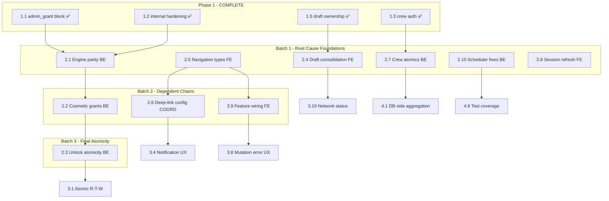

# Phase 2 Execution Plan — Contract Alignment and Broken User Flows

> **Status:** Ready to execute -- all Phase 1 gates satisfied (8/8 items shipped 2026-03-07)
> **Scope:** 10 work items across 3 sequential batches (5 backend, 4 frontend, 1 coordinated)
> **Issues targeted:** 1 Critical, 10 High, 5 Medium + 4 integration findings = 20 issue resolutions
> **Estimated effort:** 12--18 engineering days

---

## Phase 2 Overview

Phase 2 fixes cross-repo contract mismatches and restores broken user flows. After Phase 2, users can navigate core paths end-to-end with consistent behavior regardless of submission path or backend runtime.

The plan is organized into 3 sequential batches. Batches are sequenced for root-cause-first execution. Within each batch, backend and frontend tracks run in parallel.

**Key architectural risks addressed:**

- ARCH-01: Event engine dual-runtime drift (2.1, 2.2, 2.3)
- ARCH-03: Non-atomic multi-step writes (2.3, 2.7)
- ARCH-06: Scheduler operational fragility (2.10)
- ARCH-07: Auth boundary permeability (2.8)
- ARCH-08: Navigation graph erosion (2.5, 2.6, 2.9)
- Root-cause cluster: No global draft sync orchestrator (2.4)

---

## Repo Ownership Summary

- **Backend-only:** 2.1, 2.2, 2.3, 2.7, 2.10 (5 items)
- **Frontend-only:** 2.4, 2.5, 2.8, 2.9 (4 items)
- **Coordinated (frontend-first):** 2.6 (1 item -- frontend deep-link config + backend share-URL resolution handler)

---

## Dependency Graph




---

## Batch 1: Root Cause Foundations

**Priority:** HIGH -- addresses the remaining Critical issue + 5 root-cause patterns
**All items UNBLOCKED** -- Phase 1 gates satisfied, no intra-Phase-2 dependencies
**Backend and frontend tracks run fully in parallel**

---

### 2.1 -- Unify Process-Event Node/Edge Parity

- **Repo:** Backend-only
- **Designation:** Backend-first (no frontend changes; frontend benefits from consistent response shape)
- **Root cause:** ARCH-01 -- Node and Edge runtimes have silently diverged. Node calls `refresh_rating_award_profile_cache` and returns streak fields; Edge does neither. Contract docs assert parity that does not exist.
- **Issues resolved:** BE-H-04 (High), BE-H-06 (Medium), BE-H-07 (Medium), INT-02 (High)
- **Files:** `[lib/processEventEngine.js](lib/processEventEngine.js)`, `[supabase/functions/process-event/engine.ts](supabase/functions/process-event/engine.ts)`
- **Action:**
  - Add `refresh_rating_award_profile_cache` call to Edge `rating_award` handler
  - Align response shape: Edge must return `current_streak_weeks`, `longest_streak_weeks`
  - Build parity test suite: identical input to both runtimes must produce identical response shapes and side effects
- **Contract/doc update:** Update `API_CONTRACT_SCHEMA_AUDIT.md` after parity tests pass. Document canonical `rating_award` response schema.
- **Validation:**
  - Test: same `rating_award` input to Node and Edge produces identical response shape
  - Test: Edge `rating_award` calls `refresh_rating_award_profile_cache` and returns streak fields
  - Test: `rating_submitted` achievement side effects match across runtimes
  - Regression: existing rating submission flow unaffected
- **Phase 3 gate:** Unblocks 3.1 (atomic read-then-write -- cap enforcement lives in engine)

---

### 2.7 -- Make Crew Mutations Atomic

- **Repo:** Backend-only
- **Designation:** Backend-first (frontend behavior unchanged; backend data integrity improves transparently)
- **Root cause:** ARCH-03 -- Three crew mutations use multi-step PostgREST writes without transactional guarantees. Partial failures create orphan crews, incorrect member counts, and capacity oversubscription.
- **Issues resolved:** BE-D-02 (High), BE-D-03 (High), BE-D-04 (High), BE-D-06 (Medium)
- **Files:** `[routes/crews.js](routes/crews.js)`, new SQL RPCs in Supabase migrations
- **Action:**
  - Create SQL RPC `create_crew_with_owner(name, owner_id)` -- atomic `crews` + `crew_members` insert
  - Create SQL RPC `remove_crew_member(crew_id, user_id)` -- atomic delete + recount + conditional crew cleanup
  - Create SQL RPC `join_crew(crew_id, user_id, invite_code)` -- atomic capacity check under lock + insert
  - Quick fix: validate `countRes.status` before capacity logic (BE-D-06) while RPCs are built
- **Contract/doc update:** Document new RPC signatures. No API-level contract change (HTTP request/response shapes unchanged).
- **Validation:**
  - Test: create crew returns crew with owner as member (single transaction)
  - Test: simultaneous owner insert failures do not leave orphan crew
  - Test: concurrent joins near 50-member cap do not oversubscribe (run N parallel joins)
  - Test: member removal with recount failure does not delete crew
  - Regression: existing crew join/leave/create flows unchanged from frontend perspective
- **Phase 4 gate:** Unblocks 4.1 (DB-side aggregation for social queries built on atomic crew foundations)

---

### 2.10 -- Fix Scheduler Idempotency and Pagination

- **Repo:** Backend-only
- **Designation:** Backend-first (no frontend involvement; operational safety improvement)
- **Root cause:** ARCH-06 -- Both scheduler scripts lack idempotency guards, use fixed 10k limits without pagination, insert notifications without dedupe, and have no distributed locking.
- **Issues resolved:** BE-H-01 (High), BE-H-02 (High), BE-H-03 (Medium), BE-H-08 (Possible)
- **Files:** `[scripts/weekly-tabs-eval.js](scripts/weekly-tabs-eval.js)`, `[scripts/streak-risk-check.js](scripts/streak-risk-check.js)`, new migration SQL
- **Action:**
  - Create `job_runs` table with unique constraint on `(job_name, week_start)`
  - Check/insert job-run record before processing; skip if already exists
  - Add pagination loop for `user_tabs_profile` reads (cursor-based until exhaustion)
  - Add unique index on `tab_notifications(user_id, notification_type, week_start)` for dedupe
  - Add advisory lock at job start for distributed safety
- **Contract/doc update:** Document `job_runs` schema and operational runbook for manual re-runs.
- **Validation:**
  - Test: double-run of weekly-tabs-eval in same week is no-op (idempotency)
  - Test: 15k+ user fixture processes all users (pagination)
  - Test: streak-risk-check double-run does not duplicate notifications (dedupe index)
  - Regression: single normal weekly run produces correct tier/streak outcomes
- **Phase 4 gate:** Unblocks 4.6 (scheduler test coverage)

---

### 2.4 -- Fix Draft Sync: Global Orchestrator + Data Loss Prevention

- **Repo:** Frontend-only
- **Designation:** Frontend-first (no backend changes; consolidates 3 divergent submission paths into 1)
- **Root cause:** Root-cause cluster -- Instance-local `isSyncing` ref allows duplicate submissions from concurrent hook mounts. Three independent submission paths (RateScreen, Dashboard card, background sync) have different normalization and cache invalidation behavior. Draft removal before confirmed success causes data loss.
- **Issues resolved:** FE-E-01 (Critical), FE-E-03 (High), FE-J-03 (High), FE-E-04 (Medium), INT-07 (Medium), INT-12 (High)
- **Files:** `[hooks/useDraftSync.ts](hooks/useDraftSync.ts)`, `[stores/draftStore.ts](stores/draftStore.ts)`, `[screens/rate/RateScreen.tsx](screens/rate/RateScreen.tsx)`, `[screens/home/DashboardScreen.tsx](screens/home/DashboardScreen.tsx)`, `[hooks/useRatings.ts](hooks/useRatings.ts)`
- **Action:**
  - Create singleton `DraftSubmissionService` with:
    - Global in-flight guard (shared mutex, not instance-local ref)
    - Per-draft idempotent execution semantics
    - Canonical normalization (including `serve_type` -> `null`)
    - Canonical cache invalidation set (`ratings`, `stats`, `tabs`, `achievements`)
    - Draft removal only on confirmed success
  - Route all three submission paths through this service
  - Remove duplicate submission implementations from DashboardScreen and useDraftSync
- **Contract/doc update:** Document `DraftSubmissionService` API and invariants for team reference.
- **Validation:**
  - Test: parallel `syncNow` from two hook mounts produces exactly one submission per draft
  - Test: submit failure preserves draft (no data loss)
  - Test: all three entry paths (RateScreen, Dashboard card, background sync) produce identical normalization and cache invalidation
  - Test: legacy `serve_type: 'to-go'` drafts normalized to `null` on all paths
  - Regression: successful rating submission from each entry point
- **Phase 3 gate:** Unblocks 3.10 (network status cold-start -- sync actions gated on connectivity)

---

### 2.5 -- Fix Navigation Type Safety

- **Repo:** Frontend-only
- **Designation:** Frontend-first (no backend involvement; compile-time safety improvement)
- **Root cause:** ARCH-08 -- `MainTabParamList` types all tabs as `undefined`. All cross-tab navigation uses `as any` casts, bypassing compile-time route validation entirely. Brittle `getParent()?.getParent()?.navigate()` calls target wrong navigator levels.
- **Issues resolved:** FE-B-02 (High), FE-B-01 (High), FE-H-04 (Low)
- **Files:** `[types/navigation.ts](types/navigation.ts)`, `[screens/map/VenueDetailScreen.tsx](screens/map/VenueDetailScreen.tsx)`, `[screens/profile/AchievementsScreen.tsx](screens/profile/AchievementsScreen.tsx)`, multiple screens using `as any`
- **Action:**
  - Define tab routes with `NavigatorScreenParams<...StackParamList>` in `MainTabParamList`
  - Fix `VenueDetailScreen` to use `navigate('Main', { screen: 'RateTab', params: ... })` instead of double parent hop
  - Fix `AchievementsScreen` RateTab CTA to use typed navigation
  - Remove all `as any` casts from cross-tab navigation calls
  - Add type-level route contract test: compile fails if nested params are wrong
- **Contract/doc update:** None (internal type system improvement).
- **Validation:**
  - Test: TypeScript compilation catches incorrect nested route params (type-level test)
  - Test: VenueDetail "Rate this beer" CTA navigates to RateTab successfully
  - Test: AchievementsScreen RateTab CTA navigates correctly
  - Test: no `as any` casts remain in navigation calls
  - Regression: all existing cross-tab navigation flows still work
- **Gates:** Unblocks 2.6 (deep-link config) and 2.9 (feature wiring)

---

### 2.8 -- Fix Session Refresh Single-Flight

- **Repo:** Frontend-only
- **Designation:** Frontend-first (no backend changes; auth resilience improvement)
- **Root cause:** ARCH-07 -- 401 interceptor and foreground listener trigger parallel `refreshSession()` calls, creating race conditions and avoidable logout churn. Offline cold-start discards valid persisted tokens when refresh fails.
- **Issues resolved:** FE-A-02 (High), FE-A-01 (High), also fixes FE-A-03 (apiErrorMessage cleanup)
- **Files:** `[api/client.ts](api/client.ts)`, `[stores/authStore.ts](stores/authStore.ts)`, `[navigation/RootNavigator.tsx](navigation/RootNavigator.tsx)`, `[api/auth.ts](api/auth.ts)`
- **Action:**
  - Implement shared in-flight refresh promise in auth store: concurrent callers await one refresh result
  - On refresh failure with `network_keep_session`, preserve existing auth state from persisted tokens instead of routing to `AuthStack`
  - Clear `apiErrorMessage` on logout (FE-A-03)
- **Contract/doc update:** None (internal auth behavior improvement).
- **Validation:**
  - Test: parallel 401 responses trigger exactly one `refreshSession` call
  - Test: offline cold-start with valid persisted tokens stays authenticated (does not route to AuthStack)
  - Test: refresh failure on network error preserves session
  - Test: logout clears `apiErrorMessage`
  - Regression: normal login/logout/refresh cycle stable

---

## Batch 2: Dependent Chains

**Priority:** HIGH-MEDIUM -- completes engine chain, enables deep-linking, wires orphaned features
**Requires Batch 1 completion:** 2.2 needs 2.1; 2.6 and 2.9 need 2.5
**Backend and frontend tracks run in parallel**

---

### 2.2 -- Fix Achievement Cosmetic Grant Scope

- **Repo:** Backend-only
- **Designation:** Backend-first (frontend already renders cosmetics; backend gate is the fix)
- **Root cause:** ARCH-01 continuation -- `grantAchievementCosmetics` hardcodes `type=eq.border`, so achievement-linked title cosmetics are never auto-granted. Part of the dual-runtime drift pattern.
- **Issues resolved:** BE-E-02 (High)
- **Files:** `[lib/processEventEngine.js](lib/processEventEngine.js)` (apply to Edge `engine.ts` as well per 2.1 parity)
- **Action:**
  - Change `grantAchievementCosmetics` to query all achievement-linked cosmetics (remove `type=eq.border` filter)
  - Upsert all matches into `user_cosmetics`
  - Apply fix to both Node and Edge runtimes (parity enforcement from 2.1)
- **Contract/doc update:** Update cosmetics grant documentation to reflect all-type scope.
- **Validation:**
  - Test: achievement with both border AND title cosmetics grants both
  - Test: achievement with only border cosmetic still works (backward compat)
  - Test: fix applied in both Node and Edge (parity)
  - Regression: existing border-only cosmetic grants unaffected

---

### 2.6 -- Wire Deep-Link Configuration

- **Repo:** Coordinated (frontend-first, backend supporting)
- **Designation:** Frontend-first, then backend
- **Root cause:** ARCH-08 continuation + INT-01 -- Share URLs are generated (`/review/<ratingId>`) but the app has no `linking` config to receive them, and no backend handler exists to resolve them. Complete round-trip failure for every shared link.
- **Issues resolved:** FE-I-01 (High), FE-I-05 (Medium), INT-01 (High)
- **Files:**
  - Frontend: `[navigation/RootNavigator.tsx](navigation/RootNavigator.tsx)`, `[app.json](app.json)`, `[utils/constants.ts](utils/constants.ts)`, `[types/navigation.ts](types/navigation.ts)`
  - Backend (new): web redirect handler or resolution endpoint for `/review/:ratingId`
- **Action:**
  - **Frontend (first):** Add typed `linking` object to `NavigationContainer` with scheme + domain prefixes. Map paths: `/beer/:id`, `/user/:id`, `/crew/:id`, `/review/:ratingId` (with resolution to BeerDetail).
  - **Backend (second):** Add `/review/:ratingId` resolution endpoint that looks up `rating.beer_id` and returns redirect to app-link OR web fallback. Alternatively, serve a minimal web landing page with app-link meta tags.
  - Align share URL format with deep-link path mapping
- **Contract/doc update:** Document deep-link path map and share URL resolution contract between repos.
- **Validation:**
  - Test: cold-start with `beerbook://beer/123` opens BeerDetail
  - Test: foreground deep-link to `/crew/:id` navigates correctly
  - Test: `/review/:ratingId` resolves through backend to app BeerDetail
  - Test: share URL round-trip (generate -> tap -> app opens correct screen)
  - Regression: normal app launch without deep-link unaffected
- **Phase 3 gate:** Unblocks 3.4 (notification UX -- destination routes must exist for notification navigation)

---

### 2.9 -- Wire Half-Implemented Feature Entry Paths

- **Repo:** Frontend-only
- **Designation:** Frontend-first (backend endpoints already exist for most features)
- **Root cause:** ARCH-08 continuation + INT-15 -- Multiple screens and hooks exist but have no in-app entry path. Backend APIs are functional but frontend never calls them from navigable UI.
- **Issues resolved:** FE-B-04 (Medium), FE-G-01 (Medium), FE-I-02 (Medium), FE-J-02 (Medium), INT-15 (partial)
- **Files:** Various navigation and screen files across ProfileStack, AuthStack, CrewDetailScreen, SettingsScreen
- **Action:**
  - **MyInventory:** Add entry from ProfileScreen or MenuBottomSheet -> `navigate('MyInventory')`
  - **Followers/Following:** Implement destination screen/modal and wire stat row `onPress` handlers
  - **Legal links:** Wire Settings legal rows to external URLs via `Linking.openURL` with failure fallback
  - **Register/SSO:** Either wire `LoginScreen` -> `Register`/`SSO` navigation or remove routes if not in current product scope (requires product decision)
  - **Crew edit:** Surface owner-only edit action in `CrewDetailScreen` or remove `useUpdateCrew` import
- **Contract/doc update:** Document product decisions on Register/SSO scope. Update navigation reachability registry.
- **Validation:**
  - Test: MyInventory reachable from profile surface
  - Test: followers/following tappable and opens list
  - Test: legal links open external URLs
  - Test: crew owner can access edit action
  - Regression: existing navigation flows unaffected
- **Phase 3/4 gates:** Unblocks 3.8 (mutation error UX for MyInventory) and 4.3 (dead code cleanup decisions)

---

## Batch 3: Final Atomicity

**Priority:** HIGH -- completes the achievement integrity chain
**Requires Batch 2 completion:** 2.3 needs 2.2 (cosmetic grant scope fix must be in place)
**Backend-only**

---

### 2.3 -- Fix Achievement Unlock/Reward Atomicity

- **Repo:** Backend-only
- **Designation:** Backend-first (no frontend changes; data integrity improvement)
- **Root cause:** ARCH-03 -- Achievement unlock can persist `user_achievements` while silently dropping tabs reward if `tabs_ledger` insert fails. Users get achievement state without corresponding payout. Non-atomic multi-step write pattern.
- **Issues resolved:** BE-E-01 (High)
- **Files:** `[lib/processEventEngine.js](lib/processEventEngine.js)`, new SQL RPC
- **Action:**
  - Treat `tabs_ledger` reward insert failure as a hard error in `processRatingSubmitted`
  - Create SQL RPC wrapping achievement unlock + reward + cosmetic grant in one transaction
  - Add reconciliation query: find `user_achievements` rows missing corresponding `tabs_ledger` reward (data healing for existing drift)
  - Apply to both Node and Edge runtimes (parity from 2.1)
- **Contract/doc update:** Document achievement unlock transaction boundary and reconciliation query.
- **Validation:**
  - Test: achievement unlock atomically creates `user_achievements` + `tabs_ledger` + `user_cosmetics` (all or none)
  - Test: simulated `tabs_ledger` failure rolls back entire unlock (no partial state)
  - Test: reconciliation query identifies existing orphaned achievements
  - Test: both Node and Edge use the same SQL RPC (parity)
  - Regression: normal achievement unlock flow produces correct rewards

---

## Execution Timeline

```
Week 1-2: Batch 1 (parallel tracks)
  Backend:  [2.1 Engine Parity] [2.7 Crew Atomics] [2.10 Scheduler]
  Frontend: [2.4 Draft Sync]    [2.5 Nav Types]     [2.8 Session Refresh]

Week 2-3: Batch 2 (parallel tracks, after Batch 1 validation)
  Backend:  [2.2 Cosmetic Grants]
  Frontend: [2.6 Deep-Links]  [2.9 Feature Wiring]

Week 3: Batch 3
  Backend:  [2.3 Unlock Atomicity]
```

---

## Validation Checklist (End of Phase 2)

**Engine Parity (2.1, 2.2, 2.3):**

- Node and Edge `rating_award` produce identical response shapes
- Edge calls `refresh_rating_award_profile_cache` and returns streak fields
- Achievement cosmetic grants include all types (not just border)
- Achievement unlock is atomic: all-or-nothing for achievements + rewards + cosmetics
- Parity test suite passes for all event types

**Data Integrity (2.7, 2.10, 2.3):**

- Crew create is atomic (no orphan crews on partial failure)
- Crew join enforces capacity under concurrent load
- Member removal does not trigger false crew deletion
- Scheduler double-run is idempotent (no double-decay)
- Scheduler processes all users regardless of count (pagination)
- Notifications are deduplicated per user per week
- Achievement reconciliation query finds zero orphans after fix

**Draft Submission (2.4):**

- Single draft never submitted twice regardless of entry path
- Failed submission preserves draft (no data loss)
- All paths produce identical normalization (`serve_type` -> null)
- All paths produce identical cache invalidation set
- Background sync, Dashboard card, and RateScreen converge on one service

**Navigation and Deep-Links (2.5, 2.6, 2.9):**

- Zero `as any` casts in navigation calls
- TypeScript compilation catches incorrect route params
- VenueDetail -> RateTab navigation works
- Deep-link cold-start resolves to correct screen
- Share URL round-trip functional end-to-end
- MyInventory, followers/following, legal links all reachable

**Auth Resilience (2.8):**

- Parallel 401s produce exactly one refresh call
- Offline cold-start with valid tokens stays authenticated
- Logout clears `apiErrorMessage`

**Cross-Repo Regression:**

- Normal rating submission from all three entry points
- Normal crew create/join/leave flows
- Normal login/logout/refresh cycle
- Normal weekly scheduler execution
- No new console errors on frontend after backend changes

---

## Dependency and Risk Notes

**Critical path:** The backend engine chain (2.1 -> 2.2 -> 2.3) is the longest sequential dependency in Phase 2. Delays to 2.1 cascade through the entire chain. Prioritize 2.1 at the start of Batch 1.

**Highest-risk item:** 2.4 (Draft Consolidation) touches the critical submission path with the remaining Critical-severity issue (FE-E-01). This requires careful testing of all three entry points. Consider feature-flagging the new `DraftSubmissionService` behind a toggle for safe rollout.

**Coordinated item:** 2.6 (Deep-Links) is the only item requiring changes in both repos. The frontend linking config can be built and tested against mocked routes first, with the backend resolution handler added second. If backend work is delayed, the frontend config still provides value for scheme-based links (`beerbook://`).

**Product decision required:** 2.9 includes Register/SSO route wiring. This requires a product decision on whether registration and SSO are in current scope. If deferred, routes should be removed to reduce navigation graph debt.

**Phase 3 gates from Phase 2:**

- 2.1 -> 3.1 (atomic read-then-write patterns depend on engine parity for cap enforcement)
- 2.4 -> 3.10 (network status cold-start gates sync actions, which must go through consolidated service)
- 2.6 -> 3.4 (notification UX needs destination routes to exist for navigation-on-press)
- 2.9 -> 3.8 (mutation error UX for MyInventory requires the screen to be reachable)

**Phase 4 gates from Phase 2:**

- 2.7 -> 4.1 (DB-side aggregation for social queries)
- 2.1 + 2.5 + 2.10 -> 4.6 (test coverage for parity, navigation reachability, scheduler idempotency)
- 2.9 -> 4.3 (dead code cleanup depends on feature wiring decisions)

**Cross-repo regression risks:**

- 2.7 (crew atomics) changes backend data flow but preserves HTTP API shape. Frontend should not notice, but verify crew flows end-to-end.
- 2.1 (engine parity) changes Edge runtime behavior. If Edge is in active use, verify rating submissions through Edge path produce correct streak/profile data on frontend.
- 2.3 (unlock atomicity) may surface previously-silent `tabs_ledger` failures as hard errors. Monitor error rates after deploy.
- 2.6 (deep-links) introduces new app behavior for URL handling. Verify normal app launch (without deep-link) is unaffected by `linking` config addition.

