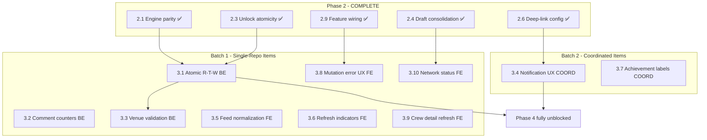

# Phase 3 Execution Plan

> **Status:** Ready for execution -- all Phase 2 gates satisfied (2026-03-07)
> **Scope:** 10 work items across 2 sequential batches (3 backend-only, 5 frontend-only, 2 coordinated)
> **Issues resolved:** 1 High, 17 Medium, 4 Low = 22 issue resolutions (including 3 integration findings)
> **Estimated effort:** 8--12 engineering days
> **Output file:** `PHASE_3_EXECUTION_PLAN.md`

---

## Phase 3 Overview

Phase 3 eliminates race conditions, fixes state synchronization gaps, and brings UX to correct behavior. After Phase 3, users get consistent, reliable feedback across all mutation paths -- no silent failures, no stale counters, no wrong-user data on foreign profiles.

The plan is organized into 2 sequential batches. Batch 1 handles all single-repo items (backend-only and frontend-only) that have zero cross-repo coordination risk. Batch 2 handles items requiring backend-frontend contract alignment. Within each batch, backend and frontend tracks run in parallel.

**Key architectural risks addressed:**

- ARCH-05: Read-then-write concurrency anti-pattern (3.1 -- systemic fix for 5 locations)
- ARCH-03: Non-atomic multi-step writes (3.1, 3.2 -- continuation from Phase 2)
- INT-04: Achievement label cross-user contamination (3.7)
- INT-05: Activity feed `feed_source` normalization mismatch (3.5)
- INT-09: Notification action payload contract missing (3.4)

**Critical path:** 3.1 (Atomicize R-T-W) is the only item containing a High-severity issue (BE-F-02). It should be the first backend item started.

---

## Repo Ownership Summary

- **Backend-only:** 3.1, 3.2, 3.3 (3 items)
- **Frontend-only:** 3.5, 3.6, 3.8, 3.9, 3.10 (5 items)
- **Coordinated (backend-first):** 3.4, 3.7 (2 items)

---

## Dependency Graph




---

## Batch 1: Single-Repo Atomicity + Independent State Fixes

**Priority:** HIGH -- contains the last remaining High-severity backend issue (BE-F-02)
**Cross-repo risk:** ZERO -- all items are single-repo. Backend and frontend tracks run fully in parallel with no coordination.
**Items:** 8 (3 backend, 5 frontend)

---

### Backend Track

---

#### 3.1 -- Atomicize Read-Then-Write Patterns (Systemic)

- **Repo:** Backend-only
- **Designation:** Backend-first (HTTP API contracts unchanged; frontend benefits transparently from data consistency)
- **Root cause:** ARCH-05 -- At least 5 distinct locations use non-atomic read-compute-write patterns. Concurrent requests produce lost increments, duplicate toggles, capacity oversubscription, and cap bypass. This is the **most common remaining bug class** in the backend.
- **Issues resolved:** BE-F-02 (High), BE-C-04 (Medium), BE-D-05 (Medium), BE-E-03 (Medium), BE-E-04 (Medium)
- **Files:** [routes/venues.js](routes/venues.js), [routes/activity.js](routes/activity.js), [routes/follows.js](routes/follows.js), [routes/tabs.js](routes/tabs.js), [lib/processEventEngine.js](lib/processEventEngine.js), new SQL migration(s)
- **Action:**
  - **Venue confirms (BE-F-02):** Create SQL RPC `confirm_venue_price(price_id, venue_id)` and `confirm_happy_hour(hh_id, venue_id)` using `UPDATE ... SET confirmed_count = confirmed_count + 1 WHERE id = $1 AND venue_id = $2 RETURNING confirmed_count`. Replaces read-then-PATCH in `routes/venues.js`.
  - **Cheers toggle (BE-C-04):** Create SQL RPC `toggle_cheers(rating_id, user_id)` that atomically checks existence, inserts or deletes, and returns `{cheered: bool, cheers_count: int}`. Replaces read-then-insert/delete in `routes/activity.js`.
  - **Follow toggle (BE-D-05):** Create SQL RPC `toggle_follow(follower_id, following_id)` that atomically checks, inserts or deletes, and returns `{following: bool}`. Replaces non-atomic toggle in `routes/follows.js`.
  - **Admin tab-award (BE-E-03):** Wrap `tabs_ledger` insert + `user_tabs_profile.lifetime_tabs_earned` increment in SQL RPC `award_tabs(user_id, amount, reason)` using `UPDATE ... SET lifetime_tabs_earned = lifetime_tabs_earned + $amount`. Replaces read-then-PATCH in `routes/tabs.js`.
  - **Weekly cap (BE-E-04):** Create SQL RPC `award_rating_tabs_with_cap(user_id, amount, weekly_cap)` with `SELECT COUNT(*) ... FOR UPDATE` + conditional insert. Apply in both Node and Edge engine runtimes (parity from 2.1). Replaces count-then-insert in `lib/processEventEngine.js`.
  - Add concurrency tests for each: N parallel requests produce deterministic outcomes.
- **Contract/doc update:** Document new RPC signatures. No HTTP API contract changes (request/response shapes preserved). Update `SYSTEM_ARCHITECTURE_RISKS.md` ARCH-05 status.
- **Validation:**
  - Test: 10 concurrent venue confirms produce exactly +10 on counter (no lost increments)
  - Test: 10 concurrent cheers toggles on same rating produce deterministic final state
  - Test: 10 concurrent follow toggles produce deterministic follow state
  - Test: concurrent admin tab awards produce correct cumulative `lifetime_tabs_earned`
  - Test: near-cap concurrent rating awards do not exceed weekly cap
  - Test: weekly cap RPC applied in both Node and Edge runtimes (parity)
  - Regression: single-user confirm/cheers/follow/award flows unchanged
- **Internal ordering note:** Complete before 3.3, which also modifies `routes/venues.js`.

---

#### 3.2 -- Fix Comment Counter Transactionality

- **Repo:** Backend-only
- **Designation:** Backend-first (frontend renders `comment_count` from API responses; no frontend changes needed)
- **Root cause:** ARCH-03 continuation -- Comment creation and deletion update `comment_count` via separate non-transactional calls. Counter drifts on partial failures.
- **Issues resolved:** BE-C-03 (Medium)
- **Files:** [server.js](server.js), new SQL migration
- **Action:**
  - Create SQL RPC `create_comment_and_increment(rating_id, user_id, content)` -- transactional comment insert + counter increment, returns new comment row.
  - Create SQL RPC `delete_comment_and_decrement(comment_id, user_id)` -- transactional ownership check + delete + counter decrement, returns success/failure.
  - Add periodic reconciliation query: `SELECT r.id, r.comment_count, COUNT(c.id) FROM ratings r LEFT JOIN rating_comments c ON c.rating_id = r.id GROUP BY r.id HAVING r.comment_count != COUNT(c.id)` -- for data healing.
  - Replace direct PostgREST comment insert/delete calls in `server.js` with RPC calls.
- **Contract/doc update:** Document new RPC signatures. HTTP API response shape unchanged.
- **Validation:**
  - Test: comment create atomically increments counter
  - Test: comment delete atomically decrements counter
  - Test: delete by non-owner returns error (ownership check)
  - Test: concurrent create + delete produces correct final count
  - Test: reconciliation query returns zero rows after fix (no drift)
  - Regression: comment CRUD flows unchanged from frontend perspective

---

#### 3.3 -- Fix Venue Endpoint Validation

- **Repo:** Backend-only
- **Designation:** Backend-first (frontend may receive new 400 errors for previously-accepted invalid inputs; see cross-repo note)
- **Root cause:** Missing input validation at API boundary allows unbounded geospatial queries, mismatched parent-child mutations, and invalid coordinate persistence.
- **Issues resolved:** BE-F-03 (Medium), BE-F-04 (Medium), BE-F-07 (Low)
- **Files:** [routes/venues.js](routes/venues.js)
- **Action:**
  - **Radius clamping (BE-F-03):** Validate `radius` parameter: reject non-positive with 400, clamp to configurable max (e.g., 50000m). Add `MAX_VENUE_RADIUS_M` config constant.
  - **Parent venue-ID validation (BE-F-04):** Change confirm endpoints to query by `(priceId, venue_id)` compound predicate, not `priceId` alone. Return 404 if parent mismatch.
  - **Coordinate validation (BE-F-07):** Add `Number.isFinite()` and range checks (`-90 <= lat <= 90`, `-180 <= lng <= 180`) for venue create coordinates. Return 400 for invalid values.
- **Contract/doc update:** Document venue API input constraints (max radius, coordinate ranges). Add 400 error codes to API contract.
- **Validation:**
  - Test: radius=0 returns 400; radius=-1 returns 400; radius=99999 is clamped to max
  - Test: confirm with mismatched venue_id returns 404
  - Test: venue create with NaN/Infinity/out-of-range coordinates returns 400
  - Regression: valid venue queries and creates unchanged
- **Cross-repo note:** Frontend may currently send very large radius values or not validate coordinates. After this lands, previously-accepted invalid inputs will return 400. Frontend venue search and create flows should be tested for graceful 400 handling. This is correct behavior -- no frontend code changes required, but verify error states render.
- **Internal ordering note:** Modify `routes/venues.js` after 3.1 has atomicized venue confirm counters.

---

### Frontend Track

---

#### 3.5 -- Fix Feed Source and Activity Normalization

- **Repo:** Frontend-only
- **Designation:** Frontend-only (backend already sends `feed_source` correctly; frontend normalization is the bug)
- **Root cause:** INT-05 -- `normalizeActivityItem()` strips top-level `feed_source` into nested `data` object, but `ActivityItem` reads `item.feed_source` at the top level for source-specific row styling. Crew/following activity rows lose visual treatment.
- **Issues resolved:** FE-D-01 (Medium), INT-05 (Medium)
- **Files:** [hooks/useSocial.ts](hooks/useSocial.ts), [components/social/ActivityItem.tsx](components/social/ActivityItem.tsx)
- **Action:**
  - Preserve `feed_source` as a typed top-level field through `normalizeActivityItem()` (either exclude from nested flattening, or re-hoist after normalization).
  - Add fallback extraction from raw payload for backward compatibility with cached data.
  - Type `feed_source` as `'crew' | 'following' | 'global' | undefined` in the normalized activity item type.
- **Contract/doc update:** None (internal normalization fix). Backend response shape unchanged.
- **Validation:**
  - Test: crew activity items retain `feed_source: 'crew'` after normalization
  - Test: following activity items retain `feed_source: 'following'` after normalization
  - Test: global activity items retain `feed_source: 'global'` after normalization
  - Test: items without `feed_source` (backward compat) default gracefully
  - Regression: activity feed rendering, pull-to-refresh, pagination unchanged

---

#### 3.6 -- Fix Economy/Browse Refresh Indicators

- **Repo:** Frontend-only
- **Designation:** Frontend-only (no backend changes; UI state derivation fix)
- **Root cause:** Hardcoded `refreshing={false}` in BrowseScreen and inconsistent use of `isRefetching` vs `isFetching` vs `isLoading` across economy screens. Pull-to-refresh gives no visual feedback.
- **Issues resolved:** FE-D-02 (Medium), FE-H-01 (Medium)
- **Files:** [screens/browse/BrowseScreen.tsx](screens/browse/BrowseScreen.tsx), TabsProfileScreen, AchievementsScreen, CosmeticsShopScreen, MyInventoryScreen
- **Action:**
  - **BrowseScreen (FE-D-02):** Replace `refreshing={false}` with `refreshing={isRefetching}` derived from the active query.
  - **Economy screens (FE-H-01):** Audit all 4 economy screens. Bind `RefreshControl.refreshing` to `isRefetching` (not `isLoading`). When multiple queries are triggered by pull-to-refresh, compose aggregate: `refreshing={ratingsRefetch || tabsRefetch || achievementsRefetch}`.
  - Establish consistent pattern: `onRefresh` calls `refetch()`, `refreshing` binds to `isRefetching`.
- **Contract/doc update:** None.
- **Validation:**
  - Test: BrowseScreen pull-to-refresh shows spinner during refetch
  - Test: TabsProfileScreen pull-to-refresh shows spinner
  - Test: AchievementsScreen pull-to-refresh shows spinner
  - Test: CosmeticsShopScreen/MyInventoryScreen pull-to-refresh shows spinner
  - Test: spinner disappears when all queries complete
  - Regression: initial load states unchanged

---

#### 3.8 -- Fix Mutation Error UX

- **Repo:** Frontend-only
- **Designation:** Frontend-only (no backend changes; error handling addition)
- **Root cause:** Cosmetic equip/unequip mutations have no `onError` callback. Failed requests fail silently with no user feedback and no defensive refetch to restore correct UI state.
- **Issues resolved:** FE-H-02 (Medium)
- **Dependency:** 2.9 (MyInventory entry path) -- SATISFIED
- **Files:** [screens/profile/MyInventoryScreen.tsx](screens/profile/MyInventoryScreen.tsx), [hooks/useCosmetics.ts](hooks/useCosmetics.ts)
- **Action:**
  - Add `onError` handlers to `equipCosmetic` and `unequipCosmetic` mutations: show error snackbar/toast + trigger `queryClient.invalidateQueries` for cosmetics keys to restore correct state.
  - Audit all economy mutations (`useEquipCosmetic`, `usePurchaseCosmetic`, etc.) for error handling parity. Ensure each has `onError` with user feedback + defensive refetch.
  - Consider extracting a shared `onMutationError(queryKeys, message)` helper for consistency.
- **Contract/doc update:** None.
- **Validation:**
  - Test: equip failure shows error snackbar and reverts optimistic UI
  - Test: unequip failure shows error snackbar and reverts optimistic UI
  - Test: all economy mutations have `onError` handlers (audit check)
  - Regression: successful equip/unequip/purchase flows unchanged

---

#### 3.9 -- Fix Crew Detail Refresh and Partial Wiring

- **Repo:** Frontend-only
- **Designation:** Frontend-only (no backend changes)
- **Root cause:** Crew detail pull-to-refresh only refetches metadata; activity timeline is not included, creating inconsistent freshness. Additionally, `useUpdateCrew` is imported but no UI action invokes it.
- **Issues resolved:** FE-G-03 (Low), FE-G-04 (Low)
- **Files:** [screens/profile/CrewDetailScreen.tsx](screens/profile/CrewDetailScreen.tsx), [hooks/useSocial.ts](hooks/useSocial.ts)
- **Action:**
  - Include activity query refetch in crew detail `onRefresh` callback alongside metadata refetch.
  - Surface owner-only "Rename Crew" action (dialog already built in 2.9) or remove `useUpdateCrew` import if edit action is deferred.
- **Contract/doc update:** None.
- **Validation:**
  - Test: crew detail pull-to-refresh refreshes both metadata and activity timeline
  - Test: crew owner sees rename action (or import is removed)
  - Regression: crew detail navigation and rendering unchanged

---

#### 3.10 -- Fix Network Status Cold-Start

- **Repo:** Frontend-only
- **Designation:** Frontend-only (no backend changes)
- **Root cause:** `useNetworkStatus` initializes `isConnected: true` before the first `NetInfo` snapshot resolves. Offline cold-start can briefly execute online write paths (draft sync, mutations) before the actual network state is known.
- **Issues resolved:** FE-J-05 (Low)
- **Dependency:** 2.4 (draft sync consolidation) -- SATISFIED (sync actions must go through consolidated service which should gate on connectivity)
- **Files:** [hooks/useNetworkStatus.ts](hooks/useNetworkStatus.ts)
- **Action:**
  - Initialize `isConnected` as `null` (unknown) instead of `true`.
  - Bootstrap from `NetInfo.fetch()` on mount to resolve actual state.
  - Gate sync/write actions (in `DraftSubmissionService` and other mutation triggers) until first network snapshot resolves (`isConnected !== null`).
- **Contract/doc update:** None.
- **Validation:**
  - Test: `isConnected` starts as `null`, resolves to `true` or `false` after `NetInfo.fetch()`
  - Test: draft sync does not fire before network status resolves
  - Test: online cold-start resolves to `isConnected: true` and unblocks sync
  - Test: offline cold-start resolves to `isConnected: false` and holds sync
  - Regression: normal online usage unaffected after initial resolution

---

## Batch 2: Coordinated Cross-Repo Items

**Priority:** MEDIUM -- no High-severity issues, but addresses visible UX gaps and a cross-repo contract hole
**Cross-repo risk:** MODERATE -- both items require backend schema/endpoint changes consumed by frontend. Backend ships first, frontend follows.
**Items:** 2 (both coordinated, backend-first)

---

### 3.4 -- Fix Notification UX: Loading States + Action Contract

- **Repo:** Coordinated (backend-first)
- **Designation:** Backend-first, then frontend
- **Root cause:** INT-09 -- Backend generates typed notifications (`streak_at_risk`, `achievement_unlock`, etc.) but includes no destination metadata. Frontend only calls `markRead()` on press with no navigation. Notifications are read-only status messages instead of actionable triggers. Additionally, FE-I-03: modal treats unloaded/error state as empty-success, showing false "All caught up" message.
- **Issues resolved:** FE-I-03 (Medium), FE-I-04 (Medium), INT-09 (Medium)
- **Dependency:** 2.6 (deep-link config) -- SATISFIED (destination routes must exist for navigation-on-press)
- **Files:**
  - Backend: `tab_notifications` table schema (migration), notification insert points in [scripts/streak-risk-check.js](scripts/streak-risk-check.js), [lib/processEventEngine.js](lib/processEventEngine.js)
  - Frontend: [components/common/NotificationsModal.tsx](components/common/NotificationsModal.tsx), [hooks/useTabs.ts](hooks/useTabs.ts), [api/tabs.ts](api/tabs.ts)
- **Action:**
  - **Backend (first):**
    - Add `target_type` (enum: `beer`, `user`, `crew`, `achievement`, `tabs_profile`) and `target_id` (text) columns to `tab_notifications` table via migration.
    - Update notification insert points to populate `target_type`/`target_id`: achievement unlocks set `target_type='achievement'`, streak warnings set `target_type='tabs_profile'`, etc.
    - Ensure existing notifications with `NULL` target fields are handled gracefully (backward compat).
  - **Frontend (second):**
    - Render distinct loading, error, and empty states in `NotificationsModal` (replace false "All caught up" on unloaded/error).
    - Define `NotificationAction` type: `{ target_type: string, target_id: string }`.
    - Implement per-type press handlers: `markRead(id)` + navigate to target route based on `target_type`.
    - Add optimistic cache update for mark-read to reduce badge/list flicker (addresses FE-I-06 partially).
- **Contract/doc update:** Document `tab_notifications` schema extension (`target_type`, `target_id`). Add notification action payload contract to cross-repo API docs.
- **Validation:**
  - Test: new notifications include `target_type` and `target_id`
  - Test: notification press marks read AND navigates to correct destination
  - Test: loading state shows spinner (not "All caught up")
  - Test: error state shows error message (not "All caught up")
  - Test: empty state (after load) shows "All caught up"
  - Test: old notifications without `target_type` degrade to mark-read-only (no crash)
  - Test: optimistic mark-read updates badge immediately
  - Regression: existing notification display and mark-read unchanged

---

### 3.7 -- Fix Achievement Labels on Foreign Profiles

- **Repo:** Coordinated (backend-first)
- **Designation:** Backend-first, then frontend. **Chosen approach: Option A** (user-scoped achievements endpoint + frontend consumption).
- **Root cause:** INT-04 -- `UserProfileScreen` renders other users' ratings with achievement badges, but labels are hydrated from `useUnlockedAchievements()` which returns the current viewer's achievements. Badges show incorrect names/icons on foreign profiles.
- **Issues resolved:** FE-G-02 (Medium), INT-04 (Medium)
- **Files:**
  - Backend: achievements route (e.g. `routes/achievements.js` or equivalent)
  - Frontend: [screens/profile/UserProfileScreen.tsx](screens/profile/UserProfileScreen.tsx), [hooks/useAchievements.ts](hooks/useAchievements.ts)
- **Action:**
  - **Backend (first):**
    - Add `GET /api/achievements?user_id=:userId` query parameter support to the existing achievements endpoint. When `user_id` is present and differs from the authenticated user, return **public** achievement metadata only (name, icon, tier, achievement id) for that user -- no grant or privilege data. When `user_id` is omitted or equals the current user, keep existing behavior (current-user achievements).
  - **Frontend (after backend ships):**
    - **User-scoped achievements hook:** Extend [hooks/useAchievements.ts](hooks/useAchievements.ts) to accept an optional `userId` (e.g. `useAchievements(userId)` or `useUserAchievements(userId)`). When `userId` is passed, call the backend with `user_id=userId`; when omitted, use existing current-user behavior. Reuse the same achievement metadata shape so badge/label components work for both.
    - **UserProfileScreen:** In [screens/profile/UserProfileScreen.tsx](screens/profile/UserProfileScreen.tsx), when the profile being viewed is **another user** (`profileUserId !== currentUser.id`), call the achievements hook with that user's id (e.g. `useAchievements(profileUserId)`) and pass that data as the source for achievement labels on rating cards. When viewing **own profile**, keep using existing current-user achievements (e.g. `useUnlockedAchievements()` or `useAchievements()` with no args).
    - **Rating cards on foreign profile:** Ensure achievement labels on rating cards in the profile feed use the **profile owner's** achievement set (from the user-scoped query), not the viewer's. No change to rating card component contract if it already receives an achievement map/lookup.
    - **Edge cases:** While user-scoped achievements are loading, hide achievement labels or show a neutral placeholder (do not fall back to viewer's data). On error or empty response, show no labels for that profile's ratings.
- **Contract/doc update:** Document `user_id` query parameter on the achievements endpoint and the public response shape for foreign-user requests.
- **Validation:**
  - Test: viewing user B's profile shows user B's achievement labels (not viewer's)
  - Test: viewing own profile still shows own achievements (unchanged behavior)
  - Test: no achievement data cross-contamination between profiles
  - Test: loading/error states on foreign profile do not show viewer's achievements
  - Regression: own profile achievement display unchanged

---

## Execution Timeline

```
Batch 1 (parallel tracks, no cross-repo coordination):
  Backend track:  3.1 → 3.2 (parallel) → 3.3 (after 3.1 for venues.js)
  Frontend track: 3.5, 3.6, 3.8, 3.9, 3.10 (all parallel, no ordering constraint)

Batch 2 (backend-first, then frontend):
  3.4: Backend schema migration → Frontend notification UX
  3.7: Backend endpoint (user_id param) → Frontend user-scoped hook + UserProfileScreen (Option A)
```

---

## Validation Checklist (End of Phase 3)

**Atomicity / Data Integrity (3.1, 3.2):**

- 10 concurrent venue confirms produce exactly +10 (no lost increments)
- Concurrent cheers toggles produce deterministic state
- Concurrent follow toggles produce deterministic state
- Concurrent tab awards produce correct cumulative total
- Near-cap rating awards do not exceed weekly cap
- Weekly cap RPC applied in both Node and Edge runtimes
- Comment create/delete atomically updates counter
- Comment counter reconciliation query returns zero drift rows

**Input Validation (3.3):**

- Unbounded radius rejected or clamped
- Mismatched venue parent-child returns 404
- Invalid coordinates rejected with 400

**Notification UX (3.4):**

- Loading/error/empty states correctly distinguished
- Notification press navigates to correct destination by type
- Old notifications without target fields degrade gracefully

**Feed / Activity (3.5):**

- `feed_source` preserved through normalization for all source types
- Activity rows show source-specific styling (crew, following, global)

**Refresh Indicators (3.6):**

- All pull-to-refresh surfaces show spinner during refetch
- Spinner disappears when all queries complete

**Achievement Labels (3.7, Option A):**

- Foreign profiles show the profile owner's achievement labels (from user-scoped achievements API)
- Own profile unchanged
- Loading/error on foreign profile do not show viewer's data

**Error UX (3.8):**

- All economy mutations have `onError` handlers with user feedback
- Failed equip/unequip shows snackbar + restores correct state

**Crew Detail (3.9):**

- Pull-to-refresh refreshes both metadata and activity

**Network Status (3.10):**

- `isConnected` starts as `null`, resolves before sync triggers
- Offline cold-start does not fire draft sync

**Cross-Repo Regression:**

- Normal rating submission from all entry points
- Normal venue search and confirm flows
- Normal follow/unfollow flows
- Normal crew detail viewing and refresh
- Normal notification display and interaction
- Normal login/logout/refresh cycle
- No new console errors on frontend after backend changes
- Frontend gracefully handles new 400 errors from 3.3 validation

---

## Dependency and Risk Notes

**Critical path:** 3.1 (Atomic R-T-W) is the highest-priority item -- it contains the last remaining High-severity backend issue (BE-F-02) and fixes 5 issues simultaneously. It also has the soft file-level dependency with 3.3 (both modify `routes/venues.js`). Start 3.1 immediately.

**Highest-risk item:** 3.1 touches 5 files across 5 different mutation paths. Each SQL RPC must be carefully designed to match existing HTTP API behavior exactly. The weekly cap RPC (BE-E-04) must be applied to both Node and Edge runtimes per Phase 2.1 parity requirements.

**Coordinated items:** 3.4 (Notifications) and 3.7 (Achievement Labels) are the only items requiring cross-repo work. Both are backend-first: backend ships schema/endpoint changes, frontend follows. If backend work is delayed, the frontend portions can be deferred without blocking Batch 1.

**3.7 (Option A chosen):** Backend implements user-scoped achievements endpoint; frontend adds user-scoped hook and uses it in UserProfileScreen for foreign profiles only.

**3.3 cross-repo impact:** Venue validation tightening (radius clamping, coordinate validation) may surface new 400 errors for edge-case frontend inputs. These are correct rejections. No frontend code changes are required, but verify the venue search and create flows handle 400 responses gracefully (error states should already exist from general error handling).

**Phase 4 gates from Phase 3:** None. Phase 4 is already fully unblocked (all gates were satisfied by Phase 2). Phases 3 and 4 could theoretically run in parallel, but Phase 3 should be prioritized for the remaining High-severity issue and the UX correctness improvements.

**Post-Phase 3 remaining issues:** After Phase 3, 0 Critical, 0 High, 5 Medium, 9 Low, and 4 Possible issues remain -- all addressed by Phase 4.

---

## Issue Resolution Map


| Item      | Issues Resolved                             | Severity         | Repo                    |
| --------- | ------------------------------------------- | ---------------- | ----------------------- |
| 3.1       | BE-F-02, BE-C-04, BE-D-05, BE-E-03, BE-E-04 | 1 High, 4 Medium | Backend                 |
| 3.2       | BE-C-03                                     | 1 Medium         | Backend                 |
| 3.3       | BE-F-03, BE-F-04, BE-F-07                   | 2 Medium, 1 Low  | Backend                 |
| 3.4       | FE-I-03, FE-I-04, INT-09                    | 3 Medium         | Coordinated             |
| 3.5       | FE-D-01, INT-05                             | 2 Medium         | Frontend                |
| 3.6       | FE-D-02, FE-H-01                            | 2 Medium         | Frontend                |
| 3.7       | FE-G-02, INT-04                             | 2 Medium         | Coordinated             |
| 3.8       | FE-H-02                                     | 1 Medium         | Frontend                |
| 3.9       | FE-G-03, FE-G-04                            | 2 Low            | Frontend                |
| 3.10      | FE-J-05                                     | 1 Low            | Frontend                |
| **Total** | **22 issues**                               | **1H, 17M, 4L**  | **3 BE, 5 FE, 2 COORD** |


