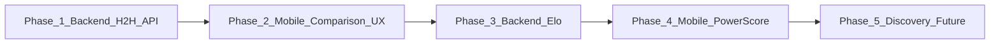

# BeerScorePlan — Phase Count and Scope

## Current state of the folder

The [BeerScorePlan](.cursor/plans/BeerScorePlan/) folder contains:

- **[head-to-head_ranking_system_0fa08338.plan.md](.cursor/plans/BeerScorePlan/head-to-head_ranking_system_0fa08338.plan.md)** — Main implementation plan with 5 phases: comparison infrastructure (mobile + backend contract), Elo engine (backend), Power Score launch (mobile), Discovery (backend + mobile), Market mechanics (future).
- **[add_postratingoverlay_rename_to_plan_8081e536.plan.md](.cursor/plans/BeerScorePlan/add_postratingoverlay_rename_to_plan_8081e536.plan.md)** — Amendment that folds renaming `TabsEarnedBanner` → `PostRatingOverlay` into Phase 1.

The main plan already defines five phases; the rename is a Phase 1 scope addition, not a separate phase.

---

## Recommendation: 5 phases (backend + mobile, context-window aware)

Keep **5 phases** total. Split work so that **each phase is one agent run** (one repo, one focused scope) to fit context windows. Backend phases are specified here so another repo/agent can implement them; mobile phases are for this repo.

| Phase | Owner                | Scope (one agent run)                                                                                                                                                                                                                                                                                                               |
| ----- | -------------------- | ----------------------------------------------------------------------------------------------------------------------------------------------------------------------------------------------------------------------------------------------------------------------------------------------------------------------------------- |
| **1** | Backend (other repo) | Head-to-head persistence and API: comparison tables, extend `POST /api/ratings` with optional `head_to_head`, add `POST /api/head-to-head/:id/complete` and `.../skip`, match-quality / when-to-prompt logic. No Elo.                                                                                                               |
| **2** | Mobile (this repo)   | Comparison UX: types + `HeadToHeadPrompt` in [src/types/api.ts](src/types/api.ts), new [src/api/headToHead.ts](src/api/headToHead.ts), rename `TabsEarnedBanner` → `PostRatingOverlay` and extend to two-phase overlay (tabs → head-to-head), RateScreen wiring, update [docs/API_CONTRACT_MOBILE.md](docs/API_CONTRACT_MOBILE.md). |
| **3** | Backend (other repo) | Elo engine: Elo calculation (e.g. initial 1500, K by maturity), `beer_elo_ratings` (and optionally events), update scores on each comparison. Optional: return `tabs_earned` in complete response.                                                                                                                                  |
| **4** | Mobile (this repo)   | Power Score surfaces: beer types for `power_score` / `global_elo` / `style_elo`, ranking UI (“Top by style,” “Trending,” etc.), “BeerBook Power Score” label.                                                                                                                                                                       |
| **5** | Backend + Mobile     | Discovery and future: backend uses Elo in search/recommendations/featured; mobile consumes existing or slightly extended discovery endpoints. Market mechanics (momentum, “stock” style, resets) remain future/design only.                                                                                                         |

---

## Context-window rationale

- **Phase 1 (backend)** — Single theme: “implement head-to-head storage and HTTP API.” One backend agent has enough context for schema, endpoints, and when to attach `head_to_head` to the create response.
- **Phase 2 (mobile)** — Single theme: “post-rating overlay and head-to-head UX.” One mobile agent can hold: api.ts types, new headToHead API, PostRatingOverlay (rename + two-phase), RateScreen changes, and doc update.
- **Phase 3 (backend)** — Single theme: “Elo pipeline.” No new mobile surface; backend-only keeps scope small.
- **Phase 4 (mobile)** — Single theme: “show Power Score and rankings.” Types + UI only; backend is already assumed to expose scores.
- **Phase 5** — Discovery is “wire Elo into discovery” (backend) plus “use existing discovery endpoints” (mobile). If one phase feels too large for one agent, Phase 5 can be split into 5a (backend discovery) and 5b (mobile discovery); that would make 6 phases. For “about 5 phases,” keeping one Discovery phase is reasonable if the mobile part is light (no new screens).

---

## Dependency order

- Phase 2 depends on Phase 1 (mobile needs the API and response shape).
- Phase 3 can start after Phase 1 (comparison data exists); Phase 4 needs Phase 3 (scores exposed).
- Phase 5 follows Phase 4.

---

## What to change in the existing plans

- **Main plan** ([head-to-head_ranking_system_0fa08338.plan.md](.cursor/plans/BeerScorePlan/head-to-head_ranking_system_0fa08338.plan.md)): Keep 5 phases but **label ownership** explicitly (e.g. “Phase 1 — Backend (other repo): …”, “Phase 2 — Mobile: …”). Apply the **PostRatingOverlay rename** in Phase 1 (mobile) as in the amendment: section 1.4 “PostRatingOverlay (rename + extend)”, and use “PostRatingOverlay” in 1.3, 1.5, and the summary table. Optionally add a short “Context window” note: each phase is scoped for one agent run.
- **Amendment plan** ([add_postratingoverlay_rename_to_plan_8081e536.plan.md](.cursor/plans/BeerScorePlan/add_postratingoverlay_rename_to_plan_8081e536.plan.md)): Once the main plan is updated, this amendment is satisfied; it can be left as historical context or marked “Merged into head-to-head plan Phase 1 (mobile).”

---

## Summary

- **Phase count: 5** (or 6 if Phase 5 is split into backend discovery + mobile discovery).
- **Backend phases (other repo):** 1, 3, and part of 5.
- **Mobile phases (this repo):** 2, 4, and part of 5.
- Phases are scoped so each fits in a single agent context window; no further splitting is required unless Phase 5 is split as above.

