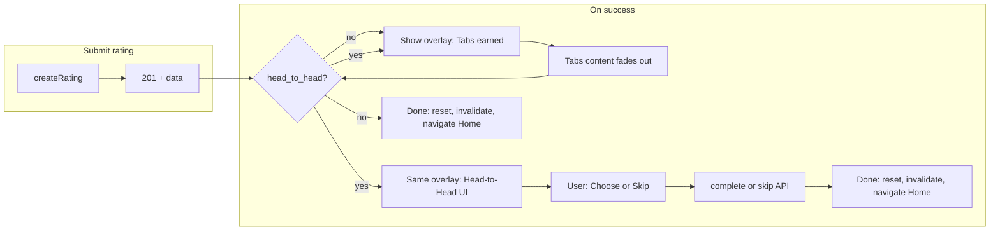

# BeerBook Head-to-Head Ranking System — Implementation Plan

This plan aligns the **beerbook-mobile** codebase with the Head-to-Head ranking spec. The repo is the **mobile app**; backend work is called out as contract/dependencies. The spec’s “three layers of truth” (user YG, head-to-head results, Elo Power Score) and safety rule (**headToHead = null → rating still succeeds**) are preserved.

---

## Current state (mobile)

- **Rating flow**: [RateScreen](src/screens/rate/RateScreen.tsx) submits via `createRating()`; `onSuccess` parses `tabs_earned` / `tabs_breakdown`, shows [TabsEarnedBanner](src/components/ratings/TabsEarnedBanner.tsx), then after 5s or dismiss calls `resetFormForNextRating()`, invalidates queries, and navigates to `HomeTab`. No head-to-head step exists.
- **API**: [docs/API_CONTRACT_MOBILE.md](docs/API_CONTRACT_MOBILE.md) already documents the **planned** head-to-head contract (lines 202–207): optional `head_to_head` on create response; `POST /api/head-to-head/:id/complete` (body: `winner_rating_id`); `POST /api/head-to-head/:id/skip`. The referenced backend doc (`.cursor/plans/head_to_head_backend_requirements.md`) is deleted; the spec you provided is the new source of truth.
- **Types**: [CreateRatingResponse](src/types/api.ts) (lines 147–168) has no `head_to_head` field. No head-to-head API or UI exists in the app.

---

## Phase 1 — Comparison infrastructure (mobile + backend contract)

**Goal**: Collect comparison data. Backend creates comparison tables and endpoints; mobile shows the prompt after rating and calls complete/skip.

### 1.1 Backend contract (dependency)

Backend must:

- Persist comparison results (e.g. `beer_head_to_head_results` per spec: `user_id`, `winner_beer_id`, `loser_beer_id`, `winner_rating_id`, `loser_rating_id`, `comparison_type`, `created_at`). No Elo yet.
- Extend **POST /api/ratings** (201) with optional top-level:
  - `head_to_head`: `null` or `{ id, reward_tabs, current_beer, challenger_beer }`.
  - `current_beer` / `challenger_beer`: minimal beer + memory cues (e.g. `rating_id`, `beer_name`, `brewery`, `style`, `venue_name`, `location_name`, `created_at`, `photo_url`) and no YG value.
- Add **POST /api/head-to-head/:id/complete** — auth required; body `{ winner_rating_id: string }`; idempotent; awards bonus tabs when applicable.
- Add **POST /api/head-to-head/:id/skip** — auth required; no body; idempotent.
- Match quality and when to offer a prompt are backend-owned (e.g. same user history, same YG band, style, memory cues, cooldowns). If no prompt: omit `head_to_head` or set `head_to_head: null`.

Mobile will **not** implement prompt selection logic; it only consumes `head_to_head` when present.

### 1.2 Mobile — types and API

- **[src/types/api.ts](src/types/api.ts)**  
  - Add to `CreateRatingResponse`: optional `head_to_head?: HeadToHeadPrompt | null`.  
  - Define:
    - `HeadToHeadPrompt`: `{ id: string; reward_tabs?: number; current_beer: HeadToHeadBeer; challenger_beer: HeadToHeadBeer }`.  
    - `HeadToHeadBeer`: e.g. `{ rating_id: string; beer_name: string; brewery?: string; style?: string; venue_name?: string; location_name?: string; created_at?: string; photo_url?: string }` (no YG).
- **New [src/api/headToHead.ts](src/api/headToHead.ts)** (or add to ratings module):  
  - `complete(id: string, winnerRatingId: string)` → `POST /api/head-to-head/:id/complete` with `{ winner_rating_id: winnerRatingId }`.  
  - `skip(id: string)` → `POST /api/head-to-head/:id/skip`.  
  Both use existing `apiClient` (auth). Return types can be minimal (e.g. 200 + optional `tabs_earned` for complete if backend sends it).
- **Guest**: Spec does not require head-to-head for guests. If backend never returns `head_to_head` for guest ratings, no mobile change. If it does, reuse same auth pattern as ratings (e.g. `X-Guest-Id` for skip/complete if backend supports it); otherwise document “head-to-head only for authenticated users.”

### 1.3 Mobile — post-rating flow: unified overlay

- **Safety**: If `data.head_to_head` is `null` or `undefined`, behavior stays exactly as today: tabs banner (if any) → dismiss → navigate to HomeTab. No new code path unless `head_to_head` is present.
- **Flow when `head_to_head` is present** (high level):
  1. Rating created; `onSuccess(data)` runs.
  2. Tabs handling unchanged: set `tabsEarnedData`, show burst + TabsEarnedBanner when `earned > 0` or cap reached.
  3. **After** the tabs banner is dismissed (or immediately if no banner), instead of navigating to HomeTab, show the **Head-to-Head** step with `data.head_to_head`.
  4. User either: **Choose** (which beer they’d rather have again) → call `complete(head_to_head.id, chosen_rating_id)` then optionally show bonus tabs and invalidate `['tabs']`; **Skip** → call `skip(head_to_head.id)`.
  5. Then: reset form, invalidate ratings/stats/tabs, navigate to HomeTab (and guest nudge if applicable).

So head-to-head is a **second phase of the same overlay**, not a separate UI. One continuous post-rating experience: tabs content fades out, then Head-to-Head appears in the same overlay.

### 1.4 Mobile — TabsEarnedBanner extended for Head-to-Head

- **Component**: Extend TabsEarnedBanner so the **same overlay** has two phases when `headToHead` is provided. **Props**: Add optional `headToHead` and `onHeadToHeadDone`. No separate screen or modal on the Rate stack (e.g. `HeadToHead` with params `{ headToHead: HeadToHeadPrompt }`) or a **modal/sheet** on top of RateScreen. Modal keeps user in “post-rate” context and avoids stack depth; screen gives full real estate for two beer cards. Recommend **modal or bottom sheet** for 2–3 second interaction; if design prefers full screen, add `HeadToHead` to [RateStackParamList](src/types/navigation.ts) and [RateStack](src/navigation/RateStack.tsx).
- **Content**:  
  - Title: e.g. “Which would you rather drink again?”  
  - Two options: **Beer A** (current_beer) and **Beer B** (challenger_beer) with memory cues: image (if `photo_url`), brewery, venue/location, date (from `created_at`).  
  - Actions: select A, select B, Skip.
- **API calls**:  
  - On choose: `headToHeadApi.complete(head_to_head.id, current_beer.rating_id)` or `challenger_beer.rating_id` depending on choice. On success: optional small “+X Tabs” for `reward_tabs`, invalidate tabs, then close and run same “done” logic (reset, invalidate, navigate).  
  - On skip: `headToHeadApi.skip(head_to_head.id)` then same “done” logic.
- **Errors**: On complete/skip failure: show snackbar or inline error; still allow “Continue” to close and navigate home so the user is never stuck.

### 1.5 RateScreen changes (concrete)

- In **onSuccess**, after building `bannerData` and setting `setTabsEarnedData` / `setShowTabsBanner(true)` (or when skipping banner), pass `data.head_to_head` into the overlay as `headToHead` prop.
- When the **tabs banner** is dismissed (existing `onDismiss` / timeout that currently calls `resetFormForNextRating`, `invalidatePostRating`, `navigation.getParent()?.navigate('HomeTab')`):
  - If `headToHeadPrompt != null`: **don’t** navigate yet; overlay transitions to Head-to-Head phase in the same overlay. Pass a single **onDone** callback that: clears `headToHeadPrompt`, runs `resetFormForNextRating()`, `invalidatePostRating()`, navigates to HomeTab, and optionally triggers guest nudge.
  - If `headToHeadPrompt == null`: keep current behavior (navigate + reset).
- For the **no-tabs path** (earned === 0 and not weekly_cap): same idea — if `data.head_to_head` present, after `invalidatePostRating()` and before `navigation.getParent()?.navigate('HomeTab')`, show head-to-head then on done navigate; else navigate immediately.

This keeps “rating submission always succeeds” and “head-to-head never blocks rating success”; the overlay is one unit that either ends after tabs or transitions tabs to head-to-head to done.

### 1.6 Documentation and onboarding

- Update [docs/API_CONTRACT_MOBILE.md](docs/API_CONTRACT_MOBILE.md): replace reference to deleted `head_to_head_backend_requirements.md` with a short “Head-to-Head” section that points to this spec and the backend contract (tables, create response shape, complete/skip). Keep the existing bullet list (extended create response, complete, skip).
- **OnboardingRateScreen**: Optional for Phase 1. If backend never returns head-to-head for the onboarding sample rating, no change. If product wants it later, same pattern: check `result.head_to_head` after create and show a minimal prompt before `navigation.navigate('OnboardingTabsExplain')`.

---

## Phase 2 — Elo engine (backend-first; no mobile API change)

- Backend implements: Elo calculation (initial 1500, K by maturity), `beer_elo_ratings` (and optionally `beer_elo_events`), updating scores after each comparison. Match quality and volatility (K) per spec.
- Mobile: **no new endpoints** in Phase 2. Comparison data is already sent via Phase 1 complete endpoint. Optional: backend includes `tabs_earned` in complete response for bonus tabs; mobile already can display it if present.

---

## Phase 3 — Power Score launch (mobile UI)

- Backend exposes **Power Score** (and possibly style-scoped Elo) on beer/catalog endpoints (e.g. `global_elo`, `style_elo`, confidence or match counts if desired).
- Mobile:  
  - Add types and any new API fields for beer (e.g. `power_score`, `global_elo`, `style_elo`).  
  - Surfaces: “Top beers by style,” “Trending,” “Rising / Falling” (if backend provides deltas or lists).  
  - Label: “BeerBook Power Score” where rankings are shown.

---

## Phase 4 — Discovery engine

- Backend uses Elo to influence search ranking, recommendations, featured beers, map suggestions.
- Mobile: consume existing or slightly extended discovery/featured/catalog endpoints; no major new screens required unless new sections (e.g. “Powered by Power Score”) are added.

---

## Phase 5 — Market mechanics

- Long-term: momentum charts, “stock exchange” style features, seasonal resets, regional rankings. Backend and mobile product design; no implementation detail in this plan.

---

## Flow diagram (Phase 1 — post-rating)

---

## Summary

| Phase | Focus                     | Mobile work                                                                                                                     |
| ----- | ------------------------- | ------------------------------------------------------------------------------------------------------------------------------- |
| 1     | Comparison infrastructure | Types, head-to-head API, TabsEarnedBanner two-phase overlay (tabs fade → Head-to-Head in same overlay), API contract doc update |
| 2     | Elo engine                | None (backend only)                                                                                                             |
| 3     | Power Score launch        | Beer types, ranking surfaces, “BeerBook Power Score” label                                                                      |
| 4     | Discovery                 | Use existing discovery endpoints influenced by Elo                                                                              |
| 5     | Market mechanics          | Future product/design                                                                                                           |

**Critical invariant**: Rating create and tabs celebration are unchanged when `head_to_head` is absent; when present, head-to-head is an optional step before going home, and complete/skip failures do not block navigation.