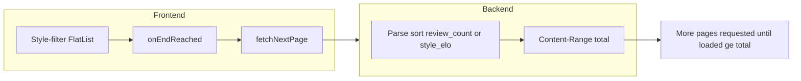

# Style-filter catalog: sort, infinite scroll, and backend fixes

## Problem summary

1. **Reverse alphabetical order** — Backend rejects `sort=style_elo` (not in whitelist) and falls back to `sort=name` with `order=desc`. Frontend re-sort by review count may not apply if `review_count` is missing or backend order dominates.
2. **No infinite scroll** — The style-filter FlatList in DiscoverScreen never calls `fetchNextPage` or uses `onEndReached`, so only the first page is shown.
3. **Pagination total** — If the backend does not return a correct `total` (e.g. when PostgREST `Content-Range` is missing and fallback is `rows.length`), the app would not request more pages even after infinite scroll is wired.

---

## Part 1: Frontend (this repo — beerbook-mobile)

### 1.1 Wire infinite scroll for the style-filter catalog list

**File:** [src/screens/discover/DiscoverScreen.tsx](src/screens/discover/DiscoverScreen.tsx)

- **Destructure** from `useBeerCatalog` (the same hook used for the style-filter catalog): `fetchNextPage`, `hasNextPage`, `isFetchingNextPage`. Currently only `data`, `isLoading`, `isRefetching`, `refetch` are used (lines 109–117).
- **Add** to the style-filter **FlatList** (lines 277–310):
  - `onEndReached`: call `fetchNextPage()` when `hasNextPage && !isFetchingNextPage` (same pattern as [ProfileScreen](src/screens/profile/ProfileScreen.tsx) line 553 or [DashboardScreen](src/screens/home/DashboardScreen.tsx) lines 405–407, 426–427).
  - `onEndReachedThreshold={0.5}` so the next page is requested before the user hits the very bottom.
- **Optional but recommended:** `ListFooterComponent` that shows a small `ActivityIndicator` when `isFetchingNextPage` is true, so users see that more items are loading.

Result: the style-filter list will request page 2, 3, … as the user scrolls, using the existing `getNextPageParam` logic in [useBeerCatalog](src/hooks/useBeers.ts) (which uses `pagination.total`).

### 1.2 Sort: use backend sort when possible (no client re-sort dependency)

Today the app sends `sort=style_elo` (rejected by backend) and then re-sorts client-side with `sortByReviewCountThenName`. To get correct order regardless of `review_count` in the response:

- **Option A (recommended short-term):** When in style-filter mode, send a **supported** sort so the backend returns the right order and the client does not need to re-sort for correctness. For example, request `sort: 'review_count'`, `order: 'desc'` when `initialStyle` is set. Then the backend returns beers by review count desc; the client can keep or drop `sortByReviewCountThenName` for tie-break (name asc).  
**Change:** In DiscoverScreen, where `useBeerCatalog` is called with `{ sort: 'style_elo', order: 'desc', style: initialStyle }`, switch to `{ sort: 'review_count', order: 'desc', style: initialStyle }` until the backend supports `style_elo`.
- **Option B (after backend supports style_elo):** Keep `sort: 'style_elo'` and rely on backend; add `style_elo` to the backend whitelist and DB/view (see Part 2). Then the client can keep `sortByReviewCountThenName` only as a tie-breaker or remove it if the backend sorts by style_elo then name.

Recommendation: implement **Option A** in the frontend now (so the list is “review count desc” without backend changes). Implement **Option B** on the backend in parallel or later and then switch the frontend back to `style_elo` if you want “Top by style — BeerBook Power Score” to be style-scoped Elo.

---

## Part 2: Backend (beerbook-api repo — separate codebase)

Paths below are relative to the API repo (e.g. `apps/beerbook-api/`).

### 2.1 Sort whitelist: support `style_elo` (optional but matches UI)

**File:** `server.js` (where `CATALOG_SORT_WHITELIST` is defined, e.g. line 62)

- Add `'style_elo'` to `CATALOG_SORT_WHITELIST`.
- **Requirement:** The PostgREST target (table or view) must expose a `style_elo` column when `style` (or `style_category`) is filtered; otherwise the API will send a sort the DB does not have. If the DB does not have `style_elo` yet, either:
  - Add a DB view/column that computes or stores style-scoped Elo and select it in the catalog request, or
  - Omit `style_elo` from the whitelist and keep using `review_count` (or `name`) for style-filtered browse until the DB is ready.

### 2.2 Catalog response: expose `style_elo` when available

**File:** `lib/catalogMap.js` (e.g. `mapCatalogBeer`)

- If the upstream row includes `style_elo`, map it into the response so the client can use it (and so future client sort by style_elo matches backend order).
- Today the mapper exposes `power_score` (from `global_elo`) and `comparison_count`; add the same for `style_elo` if the view/table provides it.

### 2.3 Pagination total: reliable `total` for infinite scroll

**File:** `server.js` (catalog browse handler, ~lines 914–959)

- Ensure the request to PostgREST uses `**Prefer: count=exact`** so PostgREST returns `Content-Range` with the full total.
- When building the response, set `pagination.total` from `totalFromContentRange(headers['content-range'])` and only fall back to `rows.length` when the header is missing (so one-page responses still work). If the fallback is used for every response, the app will think there is only one page and will not trigger infinite scroll.

---

## Implementation order

| Step | Where              | Action                                                                                                                                                                                                                              |
| ---- | ------------------ | ----------------------------------------------------------------------------------------------------------------------------------------------------------------------------------------------------------------------------------- |
| 1    | Frontend           | Destructure `fetchNextPage`, `hasNextPage`, `isFetchingNextPage` from `useBeerCatalog`; add `onEndReached` and `onEndReachedThreshold` to the style-filter FlatList; optionally add `ListFooterComponent` for `isFetchingNextPage`. |
| 2    | Frontend           | Change style-filter catalog params from `sort: 'style_elo'` to `sort: 'review_count'`, `order: 'desc'` so the backend returns review-count order without backend changes.                                                           |
| 3    | Backend            | Verify catalog handler uses `Prefer: count=exact` and that `pagination.total` is taken from Content-Range (fallback to `rows.length` only when header missing).                                                                     |
| 4    | Backend (optional) | Add `style_elo` to sort whitelist and to `mapCatalogBeer` once the DB exposes style_elo; then frontend can switch back to `sort: 'style_elo'` for “Top by style — BeerBook Power Score”.                                            |

---

## Flow after fixes

---

## File reference

| Repo            | File                                                                               | Change                                                                                                                                                                                                                                                      |
| --------------- | ---------------------------------------------------------------------------------- | ----------------------------------------------------------------------------------------------------------------------------------------------------------------------------------------------------------------------------------------------------------- |
| beerbook-mobile | [src/screens/discover/DiscoverScreen.tsx](src/screens/discover/DiscoverScreen.tsx) | Destructure fetchNextPage, hasNextPage, isFetchingNextPage; add onEndReached, onEndReachedThreshold to style-filter FlatList; optional ListFooterComponent; switch style-filter catalog to sort=review_count (or keep style_elo after backend supports it). |
| beerbook-api    | server.js                                                                          | Add `style_elo` to CATALOG_SORT_WHITELIST when DB supports it; ensure catalog handler uses Content-Range for pagination.total.                                                                                                                              |
| beerbook-api    | lib/catalogMap.js                                                                  | Map `style_elo` into catalog beer object when upstream provides it.                                                                                                                                                                                         |

